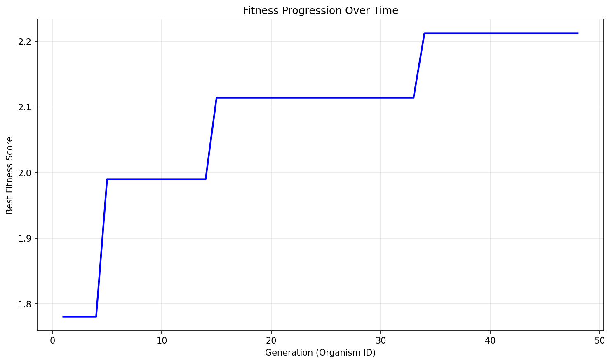

# Evolution Report

## Problem Information
- **Problem Name**: circle_packing
- **Timestamp**: 2025-06-21_15-51-47

## Hyperparameters
- **Exploration Rate**: 0.15
- **Elitism Rate**: 0.15
- **Max Steps**: 30
- **Target Fitness**: 2.636
- **Reason**: True
- **Max Concurrent**: 20

## Population Statistics
- **Number of Organisms**: 48
- **Best Fitness Score**: 2.212474520844253
- **Average Fitness Score**: 1.2062

## Fitness Progression


## Population Visualization


## Best Solution
```

import numpy as np
from scipy.optimize import minimize

def run_packing():
    # Improved initial positions with better edge utilization
    centers = np.array([
        [0.18, 0.18], [0.5, 0.18], [0.82, 0.18],
        [0.08, 0.34], [0.3, 0.34], [0.5, 0.34], [0.7, 0.34], [0.92, 0.34],
        [0.18, 0.5], [0.38, 0.5], [0.62, 0.5], [0.82, 0.5],
        [0.08, 0.66], [0.3, 0.66], [0.5, 0.66], [0.7, 0.66], [0.92, 0.66],
        [0.18, 0.82], [0.38, 0.82], [0.62, 0.82], [0.82, 0.82],
        [0.5, 0.92],
        # Adjusted corner positions to allow larger radii
        [0.07, 0.07], [0.93, 0.07], [0.07, 0.93], [0.93, 0.93]
    ])
    
    # Initial radii estimates with more aggressive scaling
    radii = np.minimum(
        np.minimum(centers[:,0], 1-centers[:,0]),
        np.minimum(centers[:,1], 1-centers[:,1])
    ) * 0.95
    
    # Optimization objective
    def objective(r):
        return -np.sum(r)
    
    # Constraints
    constraints = []
    
    # Boundary constraints
    for i in range(26):
        def make_constr(i):
            return {'type': 'ineq', 'fun': lambda r: min(
                centers[i,0] - r[i],
                centers[i,1] - r[i],
                1 - centers[i,0] - r[i],
                1 - centers[i,1] - r[i]
            )}
        constraints.append(make_constr(i))
    
    # Non-overlapping constraints
    for i in range(26):
        for j in range(i+1, 26):
            def make_constr(i, j):
                return {'type': 'ineq', 
                        'fun': lambda r: np.sqrt((centers[i,0]-centers[j,0])**2 + 
                                        (centers[i,1]-centers[j,1])**2) - r[i] - r[j]}
            constraints.append(make_constr(i,j))
    
    # Solve optimization with more iterations
    res = minimize(objective, radii, method='SLSQP', 
                   constraints=constraints,
                   options={'maxiter': 2000, 'ftol': 1e-8})
    
    radii = res.x
    sum_radii = np.sum(radii)
    
    return centers, radii, sum_radii

```

## Additional Data from Best Solution
```json
{
  "sum_radii": "2.212475",
  "target_ratio": "0.839330",
  "validity": "valid",
  "target_value": "2.636"
}
```

## Files in this Report
- `population_visualization.gv` / `population_visualization.gv.png` - Visual representation of the population
- `fitness_progression.png` - Plot showing fitness improvement over generations
- `population.json` or `population.pkl` - Serialized population data
- `report.md` - This report file
