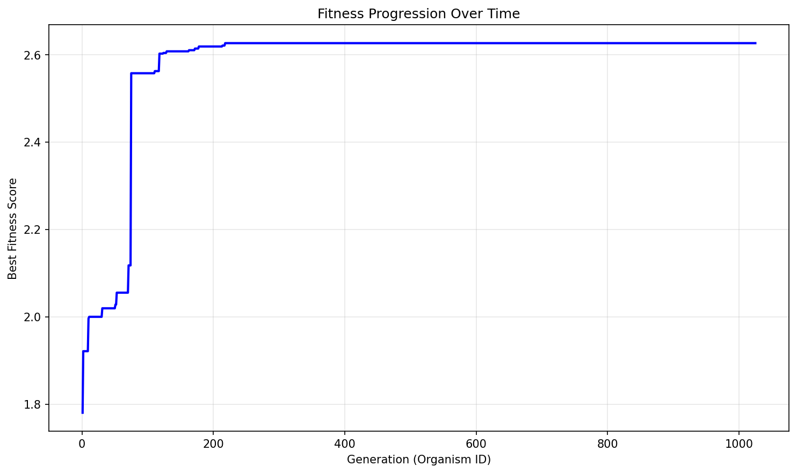

# Evolution Report

## Problem Information
- **Problem Name**: circle_packing
- **Timestamp**: 2025-06-24_19-19-31

## Hyperparameters
- **Exploration Rate**: 0.0
- **Elitism Rate**: 1.0
- **Max Steps**: 1000
- **Target Fitness**: 2.636
- **Reason**: True
- **Max Concurrent**: 40

## Population Statistics
- **Number of Organisms**: 1025
- **Best Fitness Score**: 2.6265060151492743
- **Average Fitness Score**: -214682.4708

## Fitness Progression


## Population Visualization


## Best Solution
```

import numpy as np
from scipy.optimize import minimize

def run_packing():
    n = 26
    initial_pos = np.zeros((n, 2))
    initial_pos[0] = [0.02, 0.02]
    initial_pos[1] = [0.98, 0.02]
    initial_pos[2] = [0.02, 0.98]
    initial_pos[3] = [0.98, 0.98]
    initial_pos[4] = [0.23, 0.115]
    initial_pos[5] = [0.50, 0.12]
    initial_pos[6] = [0.77, 0.115]
    initial_pos[7] = [0.23, 0.885]
    initial_pos[8] = [0.50, 0.88]
    initial_pos[9] = [0.77, 0.885]
    initial_pos[10] = [0.115, 0.23]
    initial_pos[11] = [0.115, 0.50]
    initial_pos[12] = [0.115, 0.77]
    initial_pos[13] = [0.885, 0.23]
    initial_pos[14] = [0.885, 0.50]
    initial_pos[15] = [0.885, 0.77]
    hex_scale = 0.140
    dy = hex_scale * np.sqrt(3) / 2
    center_y = 0.5
    start_y = center_y - 1.5 * dy
    initial_pos[16] = [0.5 - hex_scale/2, start_y]
    initial_pos[17] = [0.5 + hex_scale/2, start_y]
    y1 = start_y + dy
    initial_pos[18] = [0.5 - hex_scale, y1]
    initial_pos[19] = [0.5,           y1]
    initial_pos[20] = [0.5 + hex_scale, y1]
    y2 = y1 + dy
    initial_pos[21] = [0.5 - hex_scale, y2]
    initial_pos[22] = [0.5,           y2]
    initial_pos[23] = [0.5 + hex_scale, y2]
    y3 = y2 + dy
    initial_pos[24] = [0.5 - hex_scale/2, y3]
    initial_pos[25] = [0.5 + hex_scale/2, y3]
    
    initial_radii = np.zeros(n)
    for i in range(n):
        x, y = initial_pos[i]
        r = min(x, y, 1-x, 1-y) * 1.12
        for j in range(i):
            dist = np.sqrt(np.sum((initial_pos[i] - initial_pos[j])**2))
            max_r = dist - initial_radii[j]
            if max_r < r:
                r = max_r
        initial_radii[i] = r

    x0 = np.zeros(3 * n)
    x0[0::3] = initial_pos[:, 0]
    x0[1::3] = initial_pos[:, 1]
    x0[2::3] = initial_radii

    def objective(x):
        return -np.sum(x[2::3])

    def constraint(x):
        centers = np.column_stack((x[0::3], x[1::3]))
        radii = x[2::3]
        constraints = []
        for i in range(n):
            xc, yc = centers[i]
            r = radii[i]
            constraints.append(xc - r)
            constraints.append(yc - r)
            constraints.append(1 - xc - r)
            constraints.append(1 - yc - r)
        for i in range(n):
            for j in range(i+1, n):
                dx = centers[i,0] - centers[j,0]
                dy = centers[i,1] - centers[j,1]
                r_sum = radii[i] + radii[j]
                constraints.append(dx*dx + dy*dy - r_sum*r_sum)
        return np.array(constraints)

    bounds = []
    for i in range(n):
        bounds.append((0, 1))
        bounds.append((0, 1))
        bounds.append((0, 0.5))

    cons = {'type': 'ineq', 'fun': constraint}
    
    res = minimize(
        objective,
        x0,
        method='SLSQP',
        bounds=bounds,
        constraints=cons,
        options={'maxiter': 50000, 'ftol': 1e-14, 'eps': 1e-12}
    )
    
    x_opt = res.x
    centers_opt = np.column_stack((x_opt[0::3], x_opt[1::3]))
    radii_opt = x_opt[2::3]
    sum_radii = np.sum(radii_opt)
    
    return centers_opt, radii_opt, sum_radii

```

## Additional Data from Best Solution
```json
{
  "sum_radii": "2.626506",
  "target_ratio": "0.996398",
  "validity": "valid",
  "target_value": "2.636"
}
```

## Files in this Report
- `population_visualization.gv` / `population_visualization.gv.png` - Visual representation of the population
- `fitness_progression.png` - Plot showing fitness improvement over generations
- `population.json` or `population.pkl` - Serialized population data
- `report.md` - This report file
