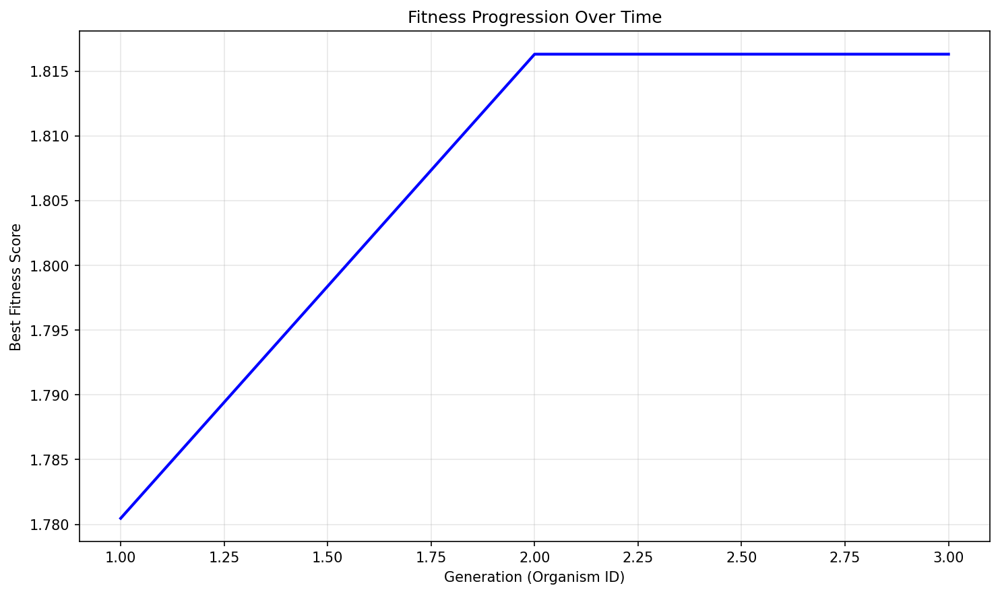

# Evolution Report

## Problem Information
- **Problem Name**: circle_packing
- **Timestamp**: 2025-06-26_01-04-10

## Hyperparameters
- **Exploration Rate**: 0.0
- **Elitism Rate**: 1.0
- **Max Steps**: 2
- **Target Fitness**: 2.636
- **Reason**: True
- **Max Concurrent**: 20

## Population Statistics
- **Number of Organisms**: 3
- **Best Fitness Score**: 1.816311892948673
- **Average Fitness Score**: 1.7228

## Fitness Progression


## Population Visualization


## Best Solution
```

import numpy as np

def run_packing():
    """
    Improved arrangement of 26 circles in unit square to maximize sum of radii.
    """
    n = 26
    centers = np.zeros((n, 2))
    
    # Central circle
    centers[0] = [0.5, 0.5]
    
    # First ring of 8 circles
    for i in range(8):
        angle = 2 * np.pi * i / 8
        centers[i + 1] = [0.5 + 0.3 * np.cos(angle), 0.5 + 0.3 * np.sin(angle)]
    
    # Second ring of 16 circles
    for i in range(16):
        angle = 2 * np.pi * i / 16
        centers[i + 9] = [0.5 + 0.45 * np.cos(angle), 0.5 + 0.45 * np.sin(angle)]
    
    # Additional circle in corner
    centers[25] = [0.9, 0.9]
    
    # Calculate radii
    radii = np.ones(n) * 0.08  # Start with larger initial radii
    
    # Limit by distance to square borders
    for i in range(n):
        x, y = centers[i]
        radii[i] = min(x, y, 1 - x, 1 - y)
    
    # Limit by distance to other circles
    for i in range(n):
        for j in range(i + 1, n):
            dist = np.sqrt(np.sum((centers[i] - centers[j]) ** 2))
            if radii[i] + radii[j] > dist * 0.98:  # Tighter packing
                scale = (dist * 0.98) / (radii[i] + radii[j])
                radii[i] *= scale
                radii[j] *= scale
    
    sum_radii = np.sum(radii)
    return centers, radii, sum_radii

```

## Additional Data from Best Solution
```json
{
  "sum_radii": "1.816312",
  "target_ratio": "0.689041",
  "validity": "valid",
  "target_value": "2.636"
}
```

## Files in this Report
- `population_visualization.gv` / `population_visualization.gv.png` - Visual representation of the population
- `fitness_progression.png` - Plot showing fitness improvement over generations
- `population.json` or `population.pkl` - Serialized population data
- `report.md` - This report file
