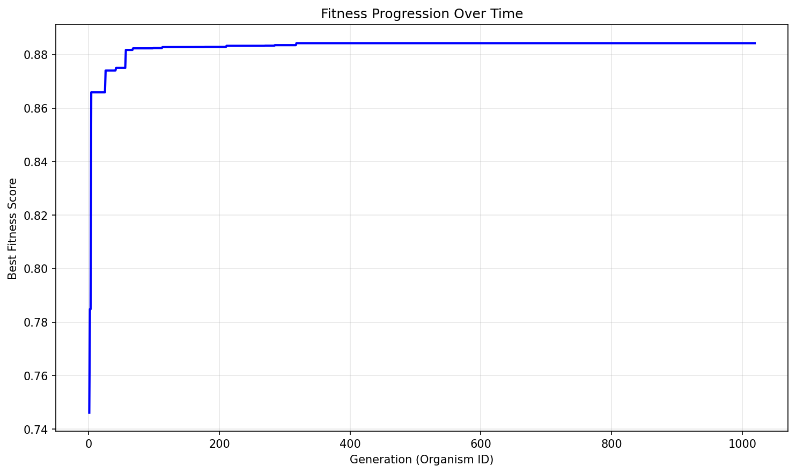
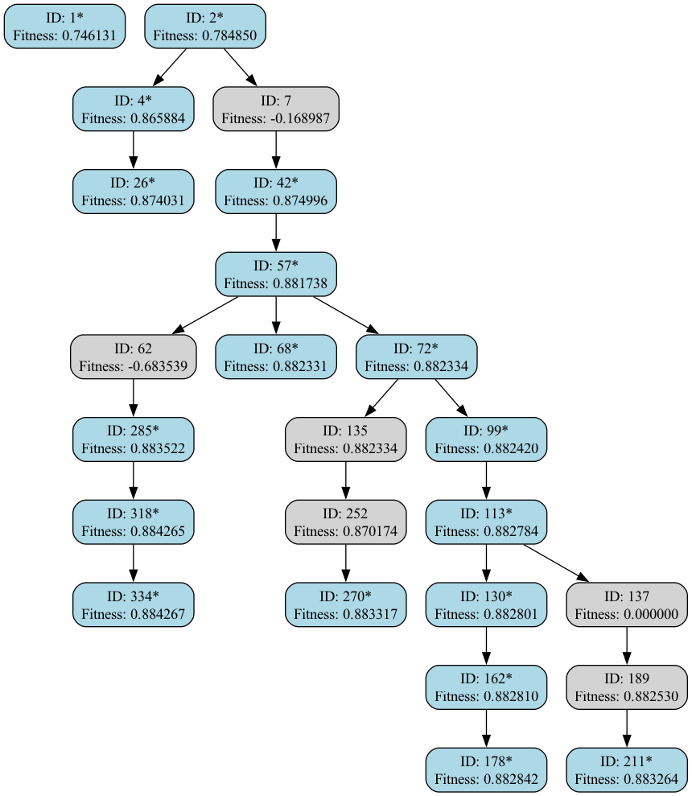

# Evolution Report

## Problem Information
- **Problem Name**: clifford_heuristic
- **Timestamp**: 2025-06-28_00-04-06

## Hyperparameters
- **Exploration Rate**: 0.1
- **Elitism Rate**: 0.3
- **Max Steps**: 1000
- **Target Fitness**: 0.95
- **Reason**: True

## Evolver Configuration
- **Max Concurrent**: 15
- **Model Mix**: {
  "deepseek:deepseek-reasoner": 0.1,
  "deepseek:deepseek-chat": 0.9
}
- **Big Changes Rate**: 0.4
- **Best Model**: deepseek:deepseek-reasoner
- **Max Children Per Organism**: 30
- **Checkpoint Dir**: evolution_results/checkpoints
- **Population Path**: None

## Population Statistics
- **Number of Organisms**: 1019
- **Best Fitness Score**: 0.88426700095711
- **Average Fitness Score**: 0.5102
- **Number of Best-So-Far Organisms**: 18

## Best-So-Far Organisms Summary
These organisms were the best fitness when they were created:

| ID | Fitness | Improvement |
|----|---------|-------------|
| 1 | 0.74613132 | +0.74613132 |
| 2 | 0.78484999 | +0.03871867 |
| 4 | 0.86588408 | +0.08103409 |
| 26 | 0.87403128 | +0.00814720 |
| 42 | 0.87499566 | +0.00096439 |
| 57 | 0.88173780 | +0.00674213 |
| 68 | 0.88233108 | +0.00059328 |
| 72 | 0.88233395 | +0.00000287 |
| 99 | 0.88241981 | +0.00008586 |
| 113 | 0.88278383 | +0.00036402 |
| 130 | 0.88280086 | +0.00001703 |
| 162 | 0.88280982 | +0.00000896 |
| 178 | 0.88284240 | +0.00003258 |
| 211 | 0.88326443 | +0.00042203 |
| 270 | 0.88331668 | +0.00005225 |
| 285 | 0.88352227 | +0.00020559 |
| 318 | 0.88426524 | +0.00074297 |
| 334 | 0.88426700 | +0.00000176 |

## Fitness Progression


## Population Visualization


## Ancestry Analysis


For detailed ancestry analysis of the best organism, see [best_ancestry.md](best_ancestry.md).

## Best Solution
```python

def heuristic(matrix):
    """Improved column-focused heuristic with enhanced sparsity and column distribution terms."""
    import numpy as np
    
    def get_heuristic(m):
        n = m.shape[0]
        col_nonzeros = np.count_nonzero(m, axis=0)
        
        # Column completion with log2 weighting
        col_completion = np.sum(np.log2(col_nonzeros + 1))
        
        # Enhanced column distribution penalty using squared differences
        col_dist = np.sum((np.sum(m, axis=0) - 1)**2)
        
        # More meaningful sparsity term using log2
        sparsity = np.log2(np.count_nonzero(m) + 1) - np.log2(n)
        
        return (col_completion, col_dist, sparsity)
    
    variants = [
        matrix,
        np.linalg.inv(matrix),
        matrix.T,
        np.linalg.inv(matrix.T)
    ]
    
    return min(get_heuristic(v) for v in variants)

```

## Additional Data from Best Solution
```json
{
  "spearman_correlation": "0.884267",
  "validity": "valid",
  "function_name": "heuristic"
}
```

## Creation Information for Best Solution
```json
{
  "model": "deepseek:deepseek-chat",
  "change_type": "SMALL ITERATIVE IMPROVEMENT",
  "step": 328,
  "is_reasoning": true,
  "big_changes_rate": 0.4,
  "child_number": 1
}
```

## Files in this Report
- `population_visualization.gv` / `population_visualization.gv.png` - Visual representation of the population
- `fitness_progression.png` - Plot showing fitness improvement over generations  
- `ancestry_graph.png` - Visualization of best organisms' ancestry relationships
- `best_ancestry.md` - Detailed ancestry analysis of the fittest organism
- `population.json` / `population.pkl` - Serialized population data
- `report.md` - This comprehensive report file

## Configuration Reproducibility

To reproduce this evolution run exactly, use the following configuration:

### Problem Specification
```python
from src.specification import get_clifford_heuristic_spec

spec = get_clifford_heuristic_spec()
```

### Evolver Configuration  
```python
evolver_config = {
  "checkpoint_dir": "evolution_results/checkpoints",
  "max_concurrent": 15,
  "model_mix": {
    "deepseek:deepseek-reasoner": 0.1,
    "deepseek:deepseek-chat": 0.9
  },
  "big_changes_rate": 0.4,
  "best_model": "deepseek:deepseek-reasoner",
  "max_children_per_organism": 30,
  "population_path": null
}
```

### Full Reproduction Script
```python
from src.evolve import AsyncEvolver

# Get specification and config
spec = get_clifford_heuristic_spec()
evolver_config = {
  "checkpoint_dir": "evolution_results/checkpoints",
  "max_concurrent": 15,
  "model_mix": {
    "deepseek:deepseek-reasoner": 0.1,
    "deepseek:deepseek-chat": 0.9
  },
  "big_changes_rate": 0.4,
  "best_model": "deepseek:deepseek-reasoner",
  "max_children_per_organism": 30,
  "population_path": null
}

# Create evolver
evolver = AsyncEvolver(
    specification=spec,
    **evolver_config
)

# Run evolution
population = await evolver.evolve()

# Generate report
from src.reporting import EvolutionReporter
reporter = EvolutionReporter(population, spec, evolver_config)
report_dir = reporter.generate_report()
```
