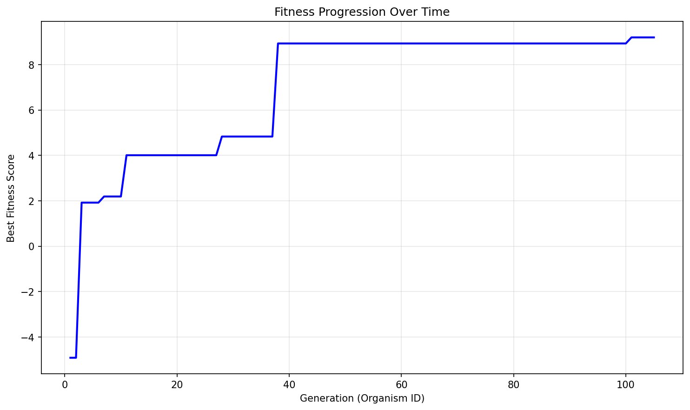
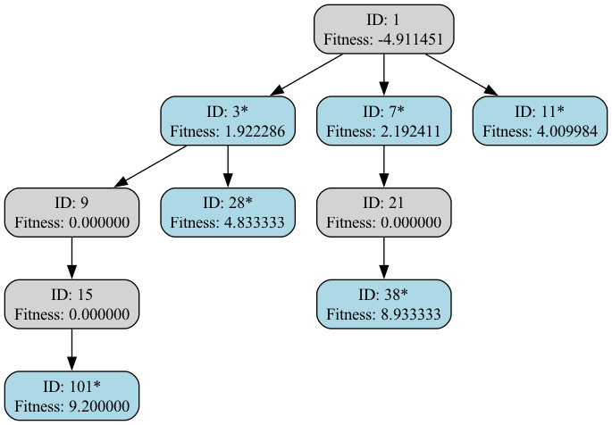

# Evolution Report

## Problem Information
- **Problem Name**: clifford_heuristic
- **Timestamp**: 2025-06-29_04-08-56

## Hyperparameters
- **Exploration Rate**: 0.1
- **Elitism Rate**: 0.3
- **Max Steps**: 100
- **Target Fitness**: 70.0
- **Reason**: True

## Evolver Configuration
- **Max Concurrent**: 7
- **Model Mix**: {
  "deepseek:deepseek-reasoner": 0.1,
  "deepseek:deepseek-chat": 0.9
}
- **Big Changes Rate**: 0.4
- **Best Model**: deepseek:deepseek-reasoner
- **Max Children Per Organism**: 15
- **Checkpoint Dir**: evolution_results/checkpoints
- **Population Path**: None

## Population Statistics
- **Number of Organisms**: 105
- **Best Fitness Score**: 9.200000000000003
- **Average Fitness Score**: 0.1611
- **Number of Best-So-Far Organisms**: 6

## Best-So-Far Organisms Summary
These organisms were the best fitness when they were created:

| ID | Fitness | Improvement |
|----|---------|-------------|
| 3 | 1.92228573 | +1.92228573 |
| 7 | 2.19241126 | +0.27012553 |
| 11 | 4.00998386 | +1.81757259 |
| 28 | 4.83333333 | +0.82334948 |
| 38 | 8.93333333 | +4.10000000 |
| 101 | 9.20000000 | +0.26666667 |

## Fitness Progression


## Population Visualization


## Ancestry Analysis


For detailed ancestry analysis of the best organism, see [best_ancestry.md](best_ancestry.md).

## Best Solution
```

def heuristic(matrix):
    import numpy as np
    n = matrix.shape[0] // 2
    U = matrix[:n, :n]
    Uinv = matrix[n:, n:].T
    a = np.sum(U) - n
    b = np.sum(Uinv) - n
    return (min(a, b), max(a, b))

```

## Additional Data from Best Solution
```json
{
  "score": "9.200000",
  "total_compute_time": "5.504313",
  "validity": "valid",
  "execution_method": "single_subprocess",
  "function_name": "heuristic"
}
```

## Creation Information for Best Solution
```json
{
  "model": "deepseek:deepseek-reasoner",
  "change_type": "SMALL ITERATIVE IMPROVEMENT",
  "step": 82,
  "is_reasoning": true,
  "big_changes_rate": 0.4,
  "child_number": 1
}
```

## Files in this Report
- `population_visualization.gv` / `population_visualization.gv.png` - Visual representation of the population
- `fitness_progression.png` - Plot showing fitness improvement over generations  
- `ancestry_graph.png` - Visualization of best organisms' ancestry relationships
- `best_ancestry.md` - Detailed ancestry analysis of the fittest organism
- `population.json` / `population.pkl` - Serialized population data
- `report.md` - This comprehensive report file

## Configuration Reproducibility

To reproduce this evolution run exactly, use the following configuration:

### Problem Specification
```python
from src.specification import get_clifford_heuristic_spec

spec = get_clifford_heuristic_spec()
```

### Evolver Configuration  
```python
evolver_config = {
  "checkpoint_dir": "evolution_results/checkpoints",
  "max_concurrent": 7,
  "model_mix": {
    "deepseek:deepseek-reasoner": 0.1,
    "deepseek:deepseek-chat": 0.9
  },
  "big_changes_rate": 0.4,
  "best_model": "deepseek:deepseek-reasoner",
  "max_children_per_organism": 15,
  "population_path": null
}
```

### Full Reproduction Script
```python
from src.evolve import AsyncEvolver

# Get specification and config
spec = get_clifford_heuristic_spec()
evolver_config = {
  "checkpoint_dir": "evolution_results/checkpoints",
  "max_concurrent": 7,
  "model_mix": {
    "deepseek:deepseek-reasoner": 0.1,
    "deepseek:deepseek-chat": 0.9
  },
  "big_changes_rate": 0.4,
  "best_model": "deepseek:deepseek-reasoner",
  "max_children_per_organism": 15,
  "population_path": null
}

# Create evolver
evolver = AsyncEvolver(
    specification=spec,
    **evolver_config
)

# Run evolution
population = await evolver.evolve()

# Generate report
from src.reporting import EvolutionReporter
reporter = EvolutionReporter(population, spec, evolver_config)
report_dir = reporter.generate_report()
```
