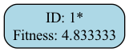

# Evolution Report

## Problem Information
- **Problem Name**: clifford_search
- **Timestamp**: 2025-06-29_16-42-21

## Hyperparameters
- **Exploration Rate**: 0.1
- **Elitism Rate**: 0.3
- **Max Steps**: 30
- **Target Fitness**: 70.0
- **Reason**: True

## Evolver Configuration
- **Max Concurrent**: 5
- **Model Mix**: {
  "deepseek:deepseek-reasoner": 0.1,
  "deepseek:deepseek-chat": 0.9
}
- **Big Changes Rate**: 0.4
- **Best Model**: deepseek:deepseek-reasoner
- **Max Children Per Organism**: 15
- **Checkpoint Dir**: evolution_results/checkpoints
- **Population Path**: None

## Population Statistics
- **Number of Organisms**: 31
- **Best Fitness Score**: 4.833333333333329
- **Average Fitness Score**: 0.1992
- **Number of Best-So-Far Organisms**: 1

## Best-So-Far Organisms Summary
These organisms were the best fitness when they were created:

| ID | Fitness | Improvement |
|----|---------|-------------|
| 1 | 4.83333333 | +4.83333333 |

## Fitness Progression


## Population Visualization


## Ancestry Analysis


For detailed ancestry analysis of the best organism, see [best_ancestry.md](best_ancestry.md).

## Best Solution
```

#!/usr/bin/env python3
"""
search.py - Self-contained CNOT circuit synthesis using GL greedy heuristic.
"""

import numpy as np
import time


def search(U):
    """
    Synthesize a CNOT circuit for an n×n invertible binary matrix U.

    Returns:
        n (int): number of qubits,
        gate_count (int): number of CNOT gates,
        depth (int): circuit depth,
        proc_time (float): synthesis time in seconds,
        check (bool): verification of correctness,
        circ (str): circuit operations string.
    """
    # Fixed parameters
    params = {
        'mode': 'GL',
        'method': 'greedy',
        'minDepth': False,
        'hv': True,
        'hi': True,
        'ht': True,
        'hl': True,
        'hr': 3,
        'wMax': 10
    }
    sym = sym_cnot(U)
    return synth_main(sym, params)


def synth_main(U, params):
    n = U.shape[1] // 2
    start = time.time()
    op_list, UC = csynth_greedy(U, params)
    # prepend single-qubit Clifford and permutation layer
    sqc_ops = mat2SQC(UC)
    full_ops = sqc_ops + op_list
    depth = len(op_list_layers(full_ops))
    gate_count = count_entangling(full_ops)
    proc_time = time.time() - start
    circ = op_list_to_string(full_ops)
    check = sym_test(U, full_ops)
    return n, gate_count, depth, proc_time, check, circ


def csynth_greedy(A, params):
    n2 = A.shape[1]
    n = n2 // 2
    U = A.copy()
    op_list = []
    h_min = None
    curr_wait = 0
    while True:
        h_val, h_tuple = gl_heuristic(U, params)
        if h_val <= 1e-5:
            break
        best = None
        best_dh = None
        best_B = None
        for op in gl_options(U):
            B = apply_op(U, op)
            hB_val, hB_tuple = gl_heuristic(B, params)
            key = (hB_tuple, hB_val) if params['hv'] else (hB_val, hB_tuple)
            dh = (0, key)
            if best_dh is None or dh < best_dh:
                best_dh = dh
                best = (hB_tuple, hB_val, op)
                best_B = B
        _, hB_val, op_chosen = best
        U = best_B
        op_list.append(op_chosen)
        if h_min is None or best < h_min:
            curr_wait = 0
            h_min = best
        else:
            curr_wait += 1
        if params['wMax'] > 0 and curr_wait > params['wMax']:
            # abort and return identity mapping
            return [], A
    op_list = list(reversed(op_list))
    return op_list, U


def gl_heuristic(U, params):
    if params['ht']:
        sA = np.concatenate([U.sum(axis=0), U.sum(axis=1)])
    else:
        sA = U.sum(axis=0)
    w = tuple(sorted(int(x) for x in sA))
    Ls = len(sA)
    if params['hl']:
        h0 = np.log(sA).sum() / Ls
    else:
        h0 = (U.sum() / len(U) - 1)
    return params['hr'] * h0, w


def gl_options(U):
    n = U.shape[1] // 2
    top = U[:n, :n]
    prod = top.T @ top
    opts = []
    rows, cols = np.nonzero(prod)
    for i, j in zip(rows, cols):
        if i != j:
            opts.append(('CX', (i, j)))
    return opts


def apply_op(U, op):
    typ, q = op
    U_new = U.copy()
    n = U.shape[1] // 2
    if typ == 'CX':
        i, j = q
        U_new[:, j] ^= U_new[:, i]
        U_new[:, n + i] ^= U_new[:, n + j]
    elif typ == 'QPerm':
        ix = list(q)
        perm = ix + [p + len(ix) for p in ix]
        U_new = U_new[:, perm]
    return U_new


def op_list_layers(op_list):
    layers = []
    for typ, q in op_list:
        qubits = set(q) if isinstance(q, tuple) else {q}
        for layer in layers:
            if qubits.isdisjoint(layer):
                layer.update(qubits)
                break
        else:
            layers.append(set(qubits))
    return layers


def count_entangling(op_list):
    return sum(1 for typ, q in op_list if typ == 'CX')


def op_list_to_string(op_list, sep=' '):
    parts = []
    for typ, q in op_list:
        if isinstance(q, tuple):
            parts.append(f'{typ}:{q[0]},{q[1]}')
        else:
            parts.append(f'{typ}:{q}')
    return sep.join(parts)


def sym_cnot(U):
    n = U.shape[0]
    S = np.zeros((2*n, 2*n), dtype=int)
    S[:n, :n] = U % 2
    inv = bin_mat_inv(U.T % 2)
    S[n:, n:] = inv % 2
    return S


def bin_mat_inv(A):
    A = A.copy() % 2
    n = A.shape[0]
    I = np.eye(n, dtype=int)
    aug = np.concatenate([A, I], axis=1)
    for i in range(n):
        if aug[i, i] == 0:
            for j in range(i+1, n):
                if aug[j, i] == 1:
                    aug[[i, j]] = aug[[j, i]]
                    break
            else:
                raise ValueError("Matrix is singular and cannot be inverted.")
        for j in range(n):
            if j != i and aug[j, i] == 1:
                aug[j] ^= aug[i]
    return aug[:, n:]

# Single-qubit Clifford layer extraction

SQC_tostr = {
    '1001': 'I', '0110': 'H',
    '1101': 'S', '1011': 'HSH',
    '1110': 'HS', '0111': 'SH'
}

def sym_r2(U):
    n = U.shape[0] // 2
    R2 = np.zeros((n, n), dtype=int)
    for i in range(n):
        for j in range(n):
            F = np.array([[U[i, j], U[i, j+n]],
                          [U[i+n, j], U[i+n, j+n]]], dtype=int)
            det = (F[0,0]*F[1,1] + F[0,1]*F[1,0]) % 2
            if det == 1:
                R2[i,j] = 1
    return R2


def perm_mat_to_ix(P):
    if (P.sum(axis=0) != 1).any() or (P.sum(axis=1) != 1).any():
        return None
    return [int(np.where(P[i])[0][0]) for i in range(P.shape[0])]


def ix_rev(ix):
    r = [0]*len(ix)
    for i, j in enumerate(ix):
        r[j] = i
    return r


def Fmat(U, i, j):
    n = U.shape[0] // 2
    return np.array([[U[i, j], U[i, j+n]],
                     [U[i+n, j], U[i+n, j+n]]], dtype=int)


def SQC2str(A):
    key = ''.join(str(int(x)) for x in A.ravel())
    return SQC_tostr.get(key, 'I')


def CList2opList(CList):
    ops = []
    for i, M in enumerate(CList):
        c = SQC2str(M)
        if c != 'I':
            ops.append((c, (i,)))
    return ops


def mat2SQC(UC):
    n = UC.shape[0] // 2
    UR2 = sym_r2(UC)
    ix = perm_mat_to_ix(UR2)
    if ix is None:
        ix = list(range(n))
    ixR = ix_rev(ix)
    CList = [Fmat(UC, i, ix[i]) for i in ixR]
    ops = CList2opList(CList)
    if ixR != list(range(n)):
        ops.insert(0, ('QPerm', tuple(ixR)))
    return ops


def op_list2sym(op_list, n):
    U = np.eye(2*n, dtype=int)
    for op in op_list:
        U = apply_op(U, op)
    return U


def sym_test(U, ops):
    n = U.shape[1] // 2
    return np.array_equal(U, op_list2sym(ops, n))


```

## Additional Data from Best Solution
```json
{
  "score": "4.833333",
  "total_compute_time": "6.035769",
  "validity": "valid",
  "execution_method": "single_subprocess",
  "function_name": "search"
}
```

## Creation Information for Best Solution
```json
null
```

## Files in this Report
- `population_visualization.gv` / `population_visualization.gv.png` - Visual representation of the population
- `fitness_progression.png` - Plot showing fitness improvement over generations  
- `ancestry_graph.png` - Visualization of best organisms' ancestry relationships
- `best_ancestry.md` - Detailed ancestry analysis of the fittest organism
- `population.json` / `population.pkl` - Serialized population data
- `report.md` - This comprehensive report file

## Configuration Reproducibility

To reproduce this evolution run exactly, use the following configuration:

### Problem Specification
```python
from src.specification import get_clifford_search_spec

spec = get_clifford_search_spec()
```

### Evolver Configuration  
```python
evolver_config = {
  "checkpoint_dir": "evolution_results/checkpoints",
  "max_concurrent": 5,
  "model_mix": {
    "deepseek:deepseek-reasoner": 0.1,
    "deepseek:deepseek-chat": 0.9
  },
  "big_changes_rate": 0.4,
  "best_model": "deepseek:deepseek-reasoner",
  "max_children_per_organism": 15,
  "population_path": null
}
```

### Full Reproduction Script
```python
from src.evolve import AsyncEvolver

# Get specification and config
spec = get_clifford_search_spec()
evolver_config = {
  "checkpoint_dir": "evolution_results/checkpoints",
  "max_concurrent": 5,
  "model_mix": {
    "deepseek:deepseek-reasoner": 0.1,
    "deepseek:deepseek-chat": 0.9
  },
  "big_changes_rate": 0.4,
  "best_model": "deepseek:deepseek-reasoner",
  "max_children_per_organism": 15,
  "population_path": null
}

# Create evolver
evolver = AsyncEvolver(
    specification=spec,
    **evolver_config
)

# Run evolution
population = await evolver.evolve()

# Generate report
from src.reporting import EvolutionReporter
reporter = EvolutionReporter(population, spec, evolver_config)
report_dir = reporter.generate_report()
```
