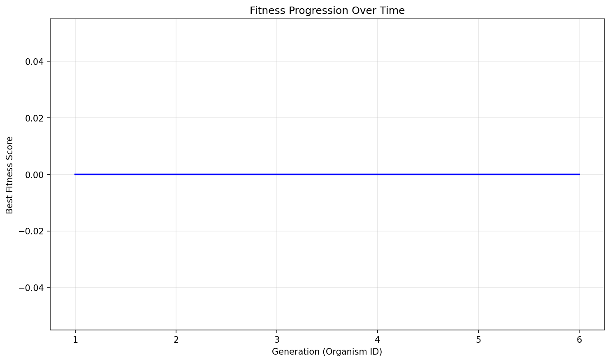

# Evolution Report

## Problem Information
- **Problem Name**: heilbronn_triangles
- **Timestamp**: 2025-07-11_17-52-08

## Hyperparameters
- **Exploration Rate**: 0.0
- **Elitism Rate**: 1.0
- **Max Steps**: 5
- **Target Fitness**: 0.037
- **Reason**: True

## Evolver Configuration
- **Max Concurrent**: 20
- **Model Mix**: {
  "deepseek:deepseek-reasoner": 0.01,
  "deepseek:deepseek-chat": 0.99
}
- **Big Changes Rate**: 0.2
- **Best Model**: deepseek:deepseek-reasoner
- **Max Children Per Organism**: 20
- **Checkpoint Dir**: checkpoints
- **Population Path**: None

## Population Statistics
- **Number of Organisms**: 6
- **Best Fitness Score**: 0.0
- **Average Fitness Score**: 0.0000
- **Number of Best-So-Far Organisms**: 0

## Best-So-Far Organisms Summary
These organisms were the best fitness when they were created:

| ID | Fitness | Improvement |
|----|---------|-------------|

## Fitness Progression


## Population Visualization


## Ancestry Analysis


For detailed ancestry analysis of the best organism, see [best_ancestry.md](best_ancestry.md).

## Best Solution
```

"""
Heilbronn problem in an equilateral triangle – n = 11

The search routine tries to *maximize* the area of the *smallest*
triangle determined by any 3 of the chosen points.

Author: ChatGPT (o3 family)
Date  : 2025-07-11
"""

from __future__ import annotations

import math
import random
import itertools
from typing import List, Tuple

import numpy as np
try:
    from scipy.optimize import minimize
except ImportError:               # allow the code to run even without SciPy
    minimize = None               # local SA is still useful

# --------------------------------------------------------------------------- #
#  Geometry helpers
# --------------------------------------------------------------------------- #

SQRT3 = math.sqrt(3.0)

def _area(p: np.ndarray, q: np.ndarray, r: np.ndarray) -> float:
    """Signed 2-D area of the triangle p-q-r divided by 2."""
    return abs(np.cross(q - p, r - p)) * 0.5

def _min_triangle_area(pts: np.ndarray) -> float:
    """Return the smallest triangle area determined by any 3 points."""
    best = float("inf")
    for i, j, k in itertools.combinations(range(len(pts)), 3):
        a = _area(pts[i], pts[j], pts[k])
        if a < best:
            best = a
            # Early exit: if we dip below current best we can break sooner
            # when called from the optimiser, but keep it simple here.
    return best

# --------------------------------------------------------------------------- #
#  Sampling inside an equilateral triangle
# --------------------------------------------------------------------------- #

_A = np.array([0.0, 0.0])
_B = np.array([1.0, 0.0])
_C = np.array([0.5, SQRT3 / 2.0])

def _random_point() -> np.ndarray:
    """Uniform random point inside the reference equilateral triangle."""
    # Exponential-map trick: generate two randoms, keep the point if u+v<=1
    while True:
        u, v = random.random(), random.random()
        if u + v <= 1.0:
            break
    return (1 - u - v) * _A + u * _B + v * _C

def _project_to_simplex(p: np.ndarray) -> np.ndarray:
    """
    Project a tentative point back into the triangle by clamping its
    barycentric coordinates.
    """
    # Express p in barycentric coords wrt (_A, _B, _C)
    M = np.column_stack((_B - _A, _C - _A))
    uv = np.linalg.lstsq(M, p - _A, rcond=None)[0]
    u, v = uv
    w = 1.0 - u - v
    # If already inside, return unchanged
    if u >= 0 and v >= 0 and w >= 0:
        return p
    # Otherwise, snap to the closest point on the triangle (quadratic-program style)
    u = max(0.0, min(1.0, u))
    v = max(0.0, min(1.0, v))
    if u + v > 1.0:
        s = u + v
        u /= s
        v /= s
    return (1 - u - v) * _A + u * _B + v * _C

# --------------------------------------------------------------------------- #
#  Simulated-annealing style global search
# --------------------------------------------------------------------------- #

def _anneal(n_pts: int = 11,
            iters: int = 50_000,
            start_temp: float = 0.05,
            end_temp: float = 1e-4,
            step_size: float = 0.04,
            seed: int | None = 0) -> np.ndarray:
    """
    Crude SA: perturb one random point at each step; accept if area improves,
    or with Metropolis probability exp((ΔA)/T) otherwise.
    """
    rng = random.Random(seed)
    pts = np.array([_random_point() for _ in range(n_pts)])
    best_pts = pts.copy()
    best_val = _min_triangle_area(best_pts)

    for t in range(iters):
        T = start_temp * (end_temp / start_temp) ** (t / (iters - 1))
        idx = rng.randrange(n_pts)
        trial = pts.copy()
        trial[idx] += rng.uniform(-step_size, step_size), rng.uniform(-step_size, step_size)
        trial[idx] = _project_to_simplex(trial[idx])

        trial_val = _min_triangle_area(trial)
        delta = trial_val - best_val

        if delta > 0 or rng.random() < math.exp(delta / max(T, 1e-12)):
            pts = trial
            if trial_val > best_val:
                best_val = trial_val
                best_pts = trial.copy()

    return best_pts

# --------------------------------------------------------------------------- #
#  Optional local polish (requires SciPy)
# --------------------------------------------------------------------------- #

def _local_polish(pts: np.ndarray, method: str = "Nelder-Mead") -> np.ndarray:
    """Simple local optimisation: maximise *negative* min-area."""
    n_pts = len(pts)
    x0 = pts.ravel()

    def f(x: np.ndarray) -> float:
        P = x.reshape((-1, 2))
        return -_min_triangle_area(P)          # minimise negative area

    res = minimize(
        f,
        x0,
        method=method,
        options=dict(maxiter=5_000, fatol=1e-10, xatol=1e-10)
    ) if minimize else None

    if res is not None and res.success:
        out = res.x.reshape((n_pts, 2))
        # In rare cases Nelder-Mead wanders outside; project back.
        for i in range(n_pts):
            out[i] = _project_to_simplex(out[i])
        return out
    return pts

# --------------------------------------------------------------------------- #
#  Public API
# --------------------------------------------------------------------------- #

def find_points(seed: int | None = 0) -> List[Tuple[float, float]]:
    """
    Heuristic solver for the Heilbronn problem with n = 11 inside the
    reference equilateral triangle.

    Parameters
    ----------
    seed : int or None
        RNG seed for reproducibility.  Pass None for stochastic runs.

    Returns
    -------
    coords : list[tuple[float, float]]
        A list of 11 (x, y) pairs.  All coordinates lie in the triangle
        with vertices (0, 0), (1, 0), (0.5, √3/2).
    """
    # 1) global crude search
    pts = _anneal(n_pts=11, iters=60_000, seed=seed)

    # 2) local deterministic polish (if SciPy available)
    pts = _local_polish(pts)

    # 3) final rounding for readability
    return [(float(f"{x:.8f}"), float(f"{y:.8f}")) for x, y in pts]


```

## Additional Data from Best Solution
```json
{
  "num_points": "0",
  "min_area_normalized": "0.0",
  "validity": "error",
  "error": "Results file not found",
  "points": "[]"
}
```

## Creation Information for Best Solution
```json
null
```

## Files in this Report
- `population_visualization.gv` / `population_visualization.gv.png` - Visual representation of the population
- `fitness_progression.png` - Plot showing fitness improvement over generations  
- `ancestry_graph.png` - Visualization of best organisms' ancestry relationships
- `best_ancestry.md` - Detailed ancestry analysis of the fittest organism
- `population.json` / `population.pkl` - Serialized population data
- `report.md` - This comprehensive report file

## Configuration Reproducibility

To reproduce this evolution run exactly, use the following configuration:

### Problem Specification
```python
from src.specification import get_heilbronn_triangles_spec

spec = get_heilbronn_triangles_spec()
```

### Evolver Configuration  
```python
evolver_config = {
  "checkpoint_dir": "checkpoints",
  "max_concurrent": 20,
  "model_mix": {
    "deepseek:deepseek-reasoner": 0.01,
    "deepseek:deepseek-chat": 0.99
  },
  "big_changes_rate": 0.2,
  "best_model": "deepseek:deepseek-reasoner",
  "max_children_per_organism": 20,
  "population_path": null
}
```

### Full Reproduction Script
```python
from src.evolve import AsyncEvolver

# Get specification and config
spec = get_heilbronn_triangles_spec()
evolver_config = {
  "checkpoint_dir": "checkpoints",
  "max_concurrent": 20,
  "model_mix": {
    "deepseek:deepseek-reasoner": 0.01,
    "deepseek:deepseek-chat": 0.99
  },
  "big_changes_rate": 0.2,
  "best_model": "deepseek:deepseek-reasoner",
  "max_children_per_organism": 20,
  "population_path": null
}

# Create evolver
evolver = AsyncEvolver(
    specification=spec,
    **evolver_config
)

# Run evolution
population = await evolver.evolve()

# Generate report
from src.reporting import EvolutionReporter
reporter = EvolutionReporter(population, spec, evolver_config)
report_dir = reporter.generate_report()
```
