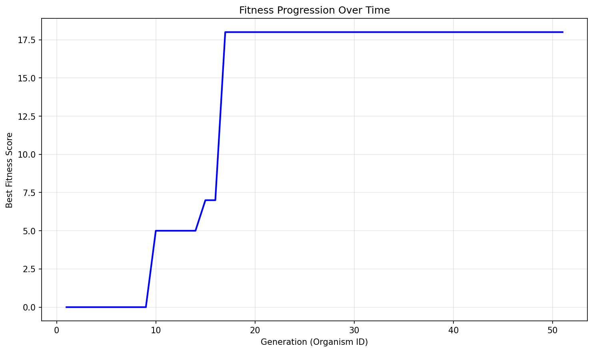

# Evolution Report

## Problem Information
- **Problem Name**: guess_the_votes (code golf)
- **Timestamp**: 2025-06-12_15-25-33

## Hyperparameters
- **Exploration Rate**: 0.1
- **Elitism Rate**: 0.2
- **Max Steps**: 50
- **Target Fitness**: 0.0
- **Reason**: False

## Population Statistics
- **Number of Organisms**: 51
- **Best Fitness Score**: 18.0
- **Average Fitness Score**: 3.6667

## Fitness Progression


## Population Visualization


## Best Solution
```

def guess_the_votes(s,v):
 from itertools import product
 r={k:set()for k in v}
 A=[x for x in product(range(len(v)),repeat=len(s))if all(sum(s[c]for k,c in enumerate(s)if x[k]==j)==v[k]for j,k in enumerate(v))]
 for i,n in enumerate(s):
  p={list(v)[x[i]]for x in A}
  if len(p)==1:r[p.pop()].add(n)
 return r

```

## Additional Data from Best Solution
```json
{
  "length": "312",
  "function_detected": "True",
  "result": "True"
}
```

## Files in this Report
- `population_visualization.gv` / `population_visualization.gv.png` - Visual representation of the population
- `fitness_progression.png` - Plot showing fitness improvement over generations
- `population.json` or `population.pkl` - Serialized population data
- `report.md` - This report file
