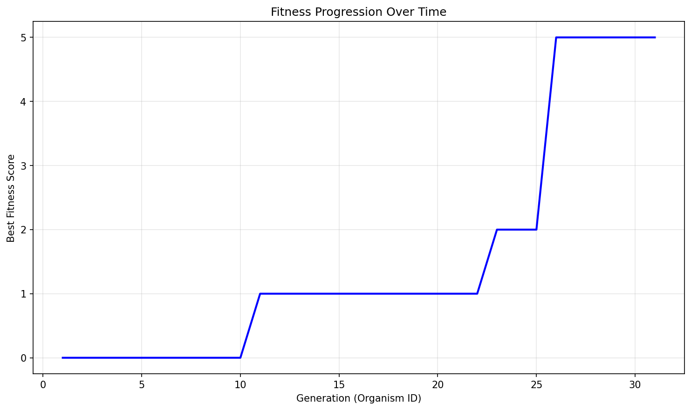

# Evolution Report

## Problem Information
- **Problem Name**: guess_the_votes (code golf)
- **Timestamp**: 2025-06-12_15-50-03

## Hyperparameters
- **Exploration Rate**: 0.1
- **Elitism Rate**: 0.2
- **Max Steps**: 30
- **Target Fitness**: 0.0
- **Reason**: False

## Population Statistics
- **Number of Organisms**: 31
- **Best Fitness Score**: 5.0
- **Average Fitness Score**: 0.1613

## Fitness Progression


## Population Visualization


## Best Solution
```

def guess_the_votes(s,v):
 from itertools import product as P
 r={k:set()for k in v}
 a,o=list(s),list(v)
 A=[x for x in P(range(len(o)),repeat=len(a))if all(sum(s[a[i]]for i,e in enumerate(x)if e==j)==v[o[j]]for j in range(len(o)))]
 for i,n in enumerate(a):
  if len({o[x[i]]for x in A})==1:r[o[A[0][i]]].add(n)
 return r

```

## Additional Data from Best Solution
```json
{
  "length": "325",
  "function_detected": "True",
  "result": "True"
}
```

## Files in this Report
- `population_visualization.gv` / `population_visualization.gv.png` - Visual representation of the population
- `fitness_progression.png` - Plot showing fitness improvement over generations
- `population.json` or `population.pkl` - Serialized population data
- `report.md` - This report file
