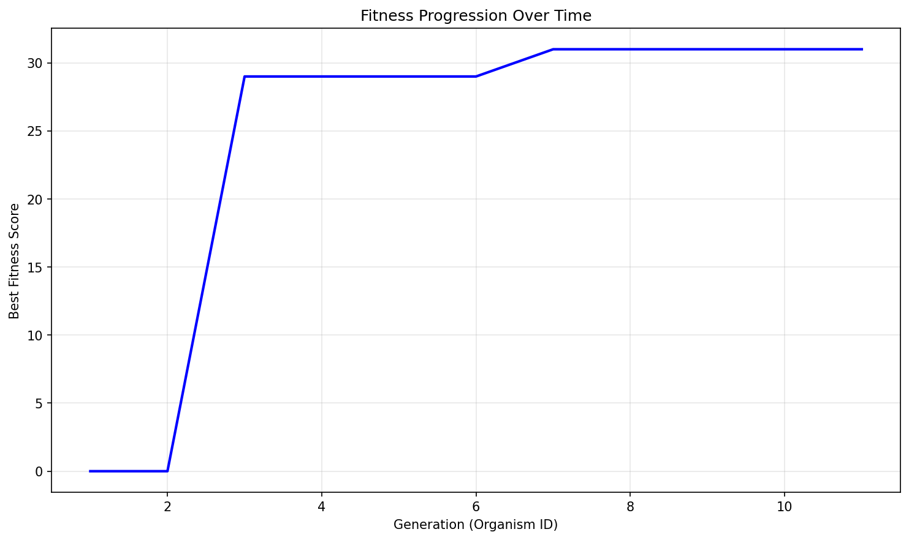

# Evolution Report

## Problem Information
- **Problem Name**: guess_the_votes (code golf)
- **Timestamp**: 2025-06-12_16-00-17

## Hyperparameters
- **Exploration Rate**: 0.1
- **Elitism Rate**: 0.2
- **Max Steps**: 10
- **Target Fitness**: 0.0
- **Reason**: True

## Population Statistics
- **Number of Organisms**: 11
- **Best Fitness Score**: 31.0
- **Average Fitness Score**: 11.4545

## Fitness Progression


## Population Visualization


## Best Solution
```

def guess_the_votes(s,v):
 from itertools import product as p
 r={k:set()for k in v}
 o=list(v)
 A=[a for a in p(range(len(o)),repeat=len(s))if all(sum(s[n]*int(x==j)for n,x in zip(s,a))==v[j]for j in o)]
 for i,n in enumerate(s):
  t={o[x[i]]for x in A}
  if len(t)==1:r[t.pop()].add(n)
 return r

```

## Additional Data from Best Solution
```json
{
  "length": "299",
  "function_detected": "True",
  "result": "False"
}
```

## Files in this Report
- `population_visualization.gv` / `population_visualization.gv.png` - Visual representation of the population
- `fitness_progression.png` - Plot showing fitness improvement over generations
- `population.json` or `population.pkl` - Serialized population data
- `report.md` - This report file
