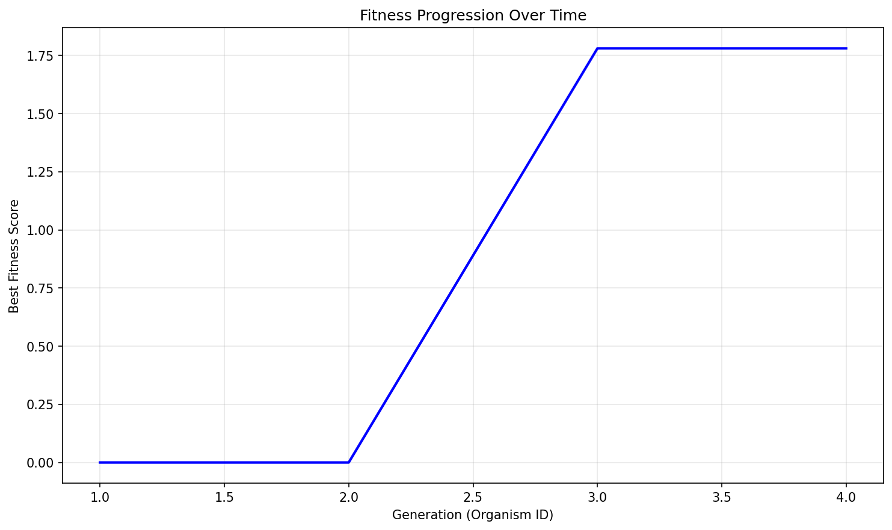

# Evolution Report

## Problem Information
- **Problem Name**: circle_packing
- **Timestamp**: 2025-06-18_12-41-40

## Hyperparameters
- **Exploration Rate**: 0.3
- **Elitism Rate**: 0.2
- **Max Steps**: 3
- **Target Fitness**: 2.635
- **Reason**: True

## Population Statistics
- **Number of Organisms**: 4
- **Best Fitness Score**: 1.7809604894777227
- **Average Fitness Score**: 0.8747

## Fitness Progression


## Population Visualization


## Best Solution
```

import numpy as np

def run_packing():
    """
    Improved: Construct arrangement of 26 circles in unit square to maximize sum of radii.
    Iteratively maximizes radii while keeping arrangement.
    """
    n = 26
    centers = np.zeros((n, 2))

    # Central circle
    centers[0] = [0.5, 0.5]

    # Ring of 8 circles (middle)
    for i in range(8):
        angle = 2 * np.pi * i / 8
        centers[i + 1] = [0.5 + 0.24 * np.cos(angle), 0.5 + 0.24 * np.sin(angle)]  # slightly closer

    # Ring of 16 circles (outer)
    for i in range(16):
        angle = 2 * np.pi * i / 16
        # Place as close to boundary as possible
        x = 0.5 + 0.44 * np.cos(angle)
        y = 0.5 + 0.44 * np.sin(angle)
        # Keep a thin margin (0.011) so initial radii not immediately zeroed
        x = np.clip(x, 0.011, 0.989)
        y = np.clip(y, 0.011, 0.989)
        centers[i + 9] = [x, y]

    # One additional circle placed above the center in a gap
    centers[25] = [0.5, 0.84]  # closer to edge

    # Don't clip all the centers, just ensure not out of square.

    # Initial radii: start small to allow growth
    radii = np.ones(n) * 0.03

    # Iteratively grow each circle to its maximal allowed radius
    for iter_no in range(8):
        for idx in range(n):
            cx, cy = centers[idx]
            # Limit by border
            border_lim = min(cx, cy, 1 - cx, 1 - cy)
            # Limit by other circles
            min_pair = border_lim
            for jdx in range(n):
                if jdx == idx: continue
                dist = np.sqrt(np.sum((centers[idx] - centers[jdx]) ** 2))
                # Prevent negative radii if centers overlap
                limit = dist - radii[jdx] - 1e-10
                if limit < min_pair:
                    min_pair = limit
            # Only allow positive radii
            radii[idx] = max(0.0, min_pair)
        # After any updates, very slightly shrink all radii (avoid pairs touching exactly)
        radii *= 0.997

    sum_radii = np.sum(radii)
    return centers, radii, sum_radii

```

## Additional Data from Best Solution
```json
{
  "sum_radii": "1.780960",
  "target_ratio": "0.675886",
  "validity": "valid",
  "target_value": "2.635"
}
```

## Files in this Report
- `population_visualization.gv` / `population_visualization.gv.png` - Visual representation of the population
- `fitness_progression.png` - Plot showing fitness improvement over generations
- `population.json` or `population.pkl` - Serialized population data
- `report.md` - This report file
