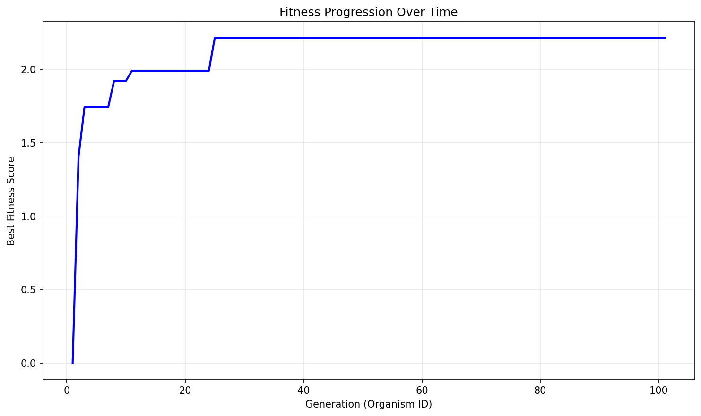

# Evolution Report

## Problem Information
- **Problem Name**: circle_packing
- **Timestamp**: 2025-06-18_13-34-35

## Hyperparameters
- **Exploration Rate**: 0.3
- **Elitism Rate**: 0.2
- **Max Steps**: 100
- **Target Fitness**: 2.635
- **Reason**: True

## Population Statistics
- **Number of Organisms**: 101
- **Best Fitness Score**: 2.212694512852617
- **Average Fitness Score**: 1.0493

## Fitness Progression


## Population Visualization


## Best Solution
```

import numpy as np

def run_packing():
    n = 26
    # Slightly larger initial radius than before
    r_init = 0.035  
    
    centers = np.zeros((n, 2))
    idx = 0
    centers[idx] = [0.5, 0.5]
    idx += 1
    
    # First shell: 8
    R1 = 0.21
    for i in range(8):
        angle = 2 * np.pi * i / 8
        centers[idx] = [0.5 + R1 * np.cos(angle),
                        0.5 + R1 * np.sin(angle)]
        idx += 1
        
    # Second shell: 12
    R2 = 0.41
    for i in range(12):
        angle = 2 * np.pi * i / 12 + (np.pi/12)  # Break symmetry for more efficient coverage
        centers[idx] = [0.5 + R2 * np.cos(angle),
                        0.5 + R2 * np.sin(angle)]
        idx += 1

    # Last shell: 5 circles close-ish to corners, each sitting in a gap of the previous shell, but not too close.
    corners = np.array([
        [0.07, 0.07],
        [0.93, 0.07],
        [0.93, 0.93],
        [0.07, 0.93],
        [0.5, 0.93]
    ])
    for i in range(5):
        centers[idx] = corners[i]
        idx += 1

    radii = np.ones(n) * r_init
    
    max_iters = 53
    grow_amt = 0.03
    for it in range(max_iters):
        # Shrink inflation step slowly as system settles
        inflation = grow_amt * (1 - it / max_iters) * 0.9 + 0.004
        
        # 1. Restrict to in-bounds
        for i in range(n):
            x, y = centers[i]
            rmax = min(x, y, 1 - x, 1 - y)
            if radii[i] > rmax:
                radii[i] = rmax

        # 2. Overlap resolution
        for i in range(n):
            for j in range(i+1, n):
                d = np.linalg.norm(centers[i] - centers[j])
                min_dist = radii[i] + radii[j]
                if d < min_dist - 1e-12:
                    overlap = min_dist - d
                    total = radii[i] + radii[j]
                    if total > 1e-12:
                        f_i = radii[i] / total
                        f_j = radii[j] / total
                        radii[i] -= overlap * f_i
                        radii[j] -= overlap * f_j
                        radii[i] = max(radii[i], 0)
                        radii[j] = max(radii[j], 0)
        
        # 3. Inflation (random ordering for more local max escape)
        order = np.arange(n)
        np.random.shuffle(order)
        for idx_i in order:
            max_r = min(centers[idx_i][0], centers[idx_i][1], 1 - centers[idx_i][0], 1 - centers[idx_i][1])
            for j in range(n):
                if idx_i == j:
                    continue
                d = np.linalg.norm(centers[idx_i] - centers[j])
                if d > 1e-14:
                    candidate = d - radii[j]
                    if candidate < max_r:
                        max_r = candidate
            radii[idx_i] = min(max_r, radii[idx_i] + inflation)
            radii[idx_i] = max(radii[idx_i], 0)
    
    # Final clean-up: shrink any that poke out of the bounds
    for i in range(n):
        x, y = centers[i]
        rmax = min(x, y, 1 - x, 1 - y)
        if radii[i] > rmax:
            radii[i] = rmax

    # Final overlap cull
    for i in range(n):
        for j in range(i + 1, n):
            d = np.linalg.norm(centers[i] - centers[j])
            min_dist = radii[i] + radii[j]
            if d < min_dist - 1e-9:
                overlap = min_dist - d
                total = radii[i] + radii[j]
                if total > 1e-10:
                    shrink_i = radii[i] / total * overlap
                    shrink_j = radii[j] / total * overlap
                    radii[i] -= shrink_i
                    radii[j] -= shrink_j
                    radii[i] = max(radii[i], 0)
                    radii[j] = max(radii[j], 0)
    
    # Border enforcement
    for i in range(n):
        x, y = centers[i]
        max_r = min(x, y, 1 - x, 1 - y)
        if radii[i] > max_r:
            radii[i] = max(0, max_r)

    radii = np.clip(radii, 0, None)
    sum_radii = np.sum(radii)
    return centers, radii, float(sum_radii)

```

## Additional Data from Best Solution
```json
{
  "sum_radii": "2.212695",
  "target_ratio": "0.839732",
  "validity": "valid",
  "target_value": "2.635"
}
```

## Files in this Report
- `population_visualization.gv` / `population_visualization.gv.png` - Visual representation of the population
- `fitness_progression.png` - Plot showing fitness improvement over generations
- `population.json` or `population.pkl` - Serialized population data
- `report.md` - This report file
