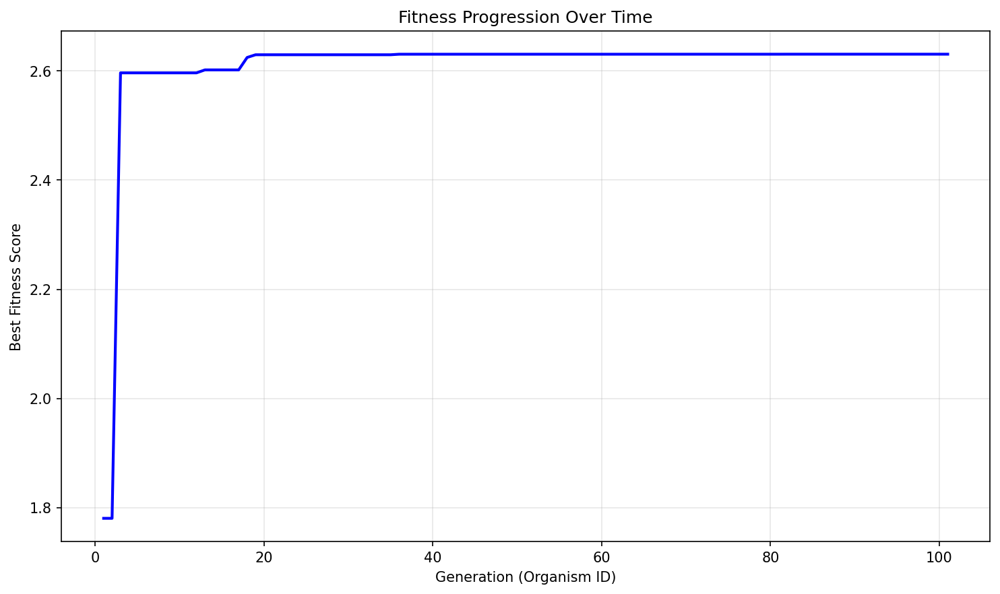

# Evolution Report

## Problem Information
- **Problem Name**: circle_packing
- **Timestamp**: 2025-06-18_16-08-27

## Hyperparameters
- **Exploration Rate**: 0.1
- **Elitism Rate**: 0.2
- **Max Steps**: 100
- **Target Fitness**: 2.636
- **Reason**: True

## Population Statistics
- **Number of Organisms**: 101
- **Best Fitness Score**: 2.6306949349088207
- **Average Fitness Score**: 1.3282

## Fitness Progression


## Population Visualization


## Best Solution
```

import numpy as np
from scipy.optimize import minimize, linprog

def run_packing():
    n = 26

    def alt_hex_coords(num, r_min=0.0385):
        rows = [6,5,5,5,5]
        coords = []
        dx = (1 - 2*r_min) / (max(rows)-1)
        dy = (1 - 2*r_min) / (len(rows)-1)
        y = r_min
        for idx, nrow in enumerate(rows):
            row_offset = (dx/2 if idx % 2 else 0) + (max(rows)-nrow)/2 * dx
            for j in range(nrow):
                x = r_min + row_offset + j * dx
                coords.append([x, y])
            y += dy
        return np.array(coords)[:num]

    r0 = 0.0365
    r_min_grid = r0 + 0.0025
    centers0 = alt_hex_coords(n, r_min=r_min_grid)
    radii0 = np.full(n, r0)
    x0 = np.concatenate([centers0.flatten(), radii0])

    cons = []
    eps = 1e-6
    for i in range(n):
        cons += [
            {'type': 'ineq', 'fun': lambda x, i=i: x[2*i]   - x[2*n+i]},
            {'type': 'ineq', 'fun': lambda x, i=i: 1 - x[2*i]    - x[2*n+i]},
            {'type': 'ineq', 'fun': lambda x, i=i: x[2*i+1] - x[2*n+i]},
            {'type': 'ineq', 'fun': lambda x, i=i: 1 - x[2*i+1] - x[2*n+i]},
            {'type': 'ineq', 'fun': lambda x, i=i: x[2*n+i] - 0.008},
            {'type': 'ineq', 'fun': lambda x, i=i: 0.16 - x[2*n+i]},
        ]
    for i in range(n):
        for j in range(i+1, n):
            cons.append({
                'type': 'ineq',
                'fun': lambda x, i=i, j=j: (
                    np.hypot(x[2*i] - x[2*j], x[2*i+1] - x[2*j+1])
                    - (x[2*n+i] + x[2*n+j] + eps)
                )
            })

    def objective(x):
        return -np.sum(x[2*n:])

    def optimize_once(x0, seed=None, jitter=0.0):
        xstart = x0.copy()
        if seed is not None:
            np.random.seed(seed)
        if jitter > 0:
            xstart[:2*n] += (np.random.rand(2*n) - 0.5) * jitter
        res = minimize(
            objective, xstart, constraints=cons, method='SLSQP',
            options={'ftol':1e-12, 'maxiter':10000, 'disp':False}
        )
        if res.success:
            return res.x, -res.fun
        else:
            return xstart, np.sum(xstart[2*n:])

    xs, fits = [], []
    xbest, fbest = optimize_once(x0, seed=0, jitter=0.0)
    xs.append(xbest); fits.append(fbest)
    jitters = [0.005, 0.010, 0.015, 0.020, 0.030, 0.040, 0.050, 0.060]
    for idx, jit in enumerate(jitters):
        xtry, ftry = optimize_once(xbest, seed=200+idx, jitter=jit)
        xs.append(xtry); fits.append(ftry)
    ib = int(np.argmax(fits))
    xopt = xs[ib]
    centers = xopt[:2*n].reshape(n,2)
    radii   = xopt[2*n:]

    def inflate(centers, radii, iterations=20, eps=1e-9):
        n = len(radii)
        for _ in range(iterations):
            for i in range(n):
                x_i, y_i = centers[i]
                r_max = min(x_i, 1-x_i, y_i, 1-y_i)
                for j in range(n):
                    if i == j: continue
                    d = np.hypot(x_i-centers[j,0], y_i-centers[j,1]) - radii[j]
                    if d < r_max:
                        r_max = d
                radii[i] = max(radii[i], max(0.0, r_max - eps))
        return radii

    radii = inflate(centers, radii, iterations=20)

    A = []
    b = []
    for i in range(n):
        xi, yi = centers[i]
        bound_i = min(xi,1-xi,yi,1-yi)
        row = np.zeros(n)
        row[i] = 1
        A.append(row); b.append(bound_i)
    for i in range(n):
        for j in range(i+1, n):
            d = np.hypot(centers[i,0]-centers[j,0], centers[i,1]-centers[j,1])
            row = np.zeros(n)
            row[i] = 1; row[j] = 1
            A.append(row); b.append(d)
    A = np.array(A); b = np.array(b)
    res_lp = linprog(-np.ones(n), A_ub=A, b_ub=b,
                     bounds=[(0,None)]*n, method='highs')
    if res_lp.success:
        radii = res_lp.x

    sum_radii = float(np.sum(radii))
    return centers, radii, sum_radii

```

## Additional Data from Best Solution
```json
{
  "sum_radii": "2.630695",
  "target_ratio": "0.998366",
  "validity": "valid",
  "target_value": "2.635"
}
```

## Files in this Report
- `population_visualization.gv` / `population_visualization.gv.png` - Visual representation of the population
- `fitness_progression.png` - Plot showing fitness improvement over generations
- `population.json` or `population.pkl` - Serialized population data
- `report.md` - This report file
