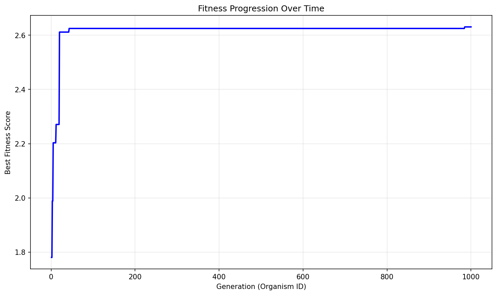

# Evolution Report (Evolver2 - Stochastic)

## Problem Information
- **Problem Name**: circle_packing
- **Timestamp**: 2025-06-19_10-32-28
- **Evolver**: Evolver2 (with stochastic behaviors)

## Hyperparameters
- **Exploration Rate**: 0.1
- **Elitism Rate**: 0.2
- **Max Steps**: 1000
- **Target Fitness**: 2.636
- **Reason**: True

## Stochastic Behaviors
- **1/100 iterations**: Large change to best solution using openai:o4-mini-2025-04-16
- **1/100 iterations**: Small iterative changes to best solution using openai:o4-mini-2025-04-16 (until no improvement)
- **Rest**: Normal evolution with model selection (openai:o4-mini-2025-04-16: 1/100, openai:gpt-4.1: ~14%, openai:gpt-4.1-mini: rest)
- **Big changes parameter**: 0.6 for below-average fitness, 0.2 for above-average fitness

## Population Statistics
- **Number of Organisms**: 1000
- **Best Fitness Score**: 2.630613261314242
- **Average Fitness Score**: 1.4186

## Fitness Progression


## Population Visualization


## Best Solution
```

import numpy as np
from scipy.optimize import minimize

def pack_objective(x, n):
    return -np.sum(x[2::3])

def pack_constraints(x, n):
    constr = []
    for i in range(n):
        xi, yi, ri = x[3*i], x[3*i+1], x[3*i+2]
        constr.append(xi - ri)
        constr.append(1 - xi - ri)
        constr.append(yi - ri)
        constr.append(1 - yi - ri)
        constr.append(ri)
    for i in range(n):
        xi, yi, ri = x[3*i], x[3*i+1], x[3*i+2]
        for j in range(i+1, n):
            xj, yj, rj = x[3*j], x[3*j+1], x[3*j+2]
            constr.append(np.hypot(xi - xj, yi - yj) - (ri + rj))
    return np.array(constr)

def initial_hybrid_hex_grid(n, rows, random_shift=0.0):
    total_rows = len(rows)
    y_step = 1/(total_rows+1)
    centers = []
    for i, num in enumerate(rows):
        x_step = 1/(num+1)
        half = (x_step/2 if (i % 2 == 1) else 0.0)
        y = (i+1)*y_step
        for j in range(num):
            x = (j+1)*x_step + half
            if random_shift > 0.:
                x += np.random.uniform(-random_shift, random_shift)*x_step
                yj = y + np.random.uniform(-random_shift, random_shift)*y_step
            else:
                yj = y
            centers.append([x, yj])
    centers = np.array(centers)[:n]
    radii = []
    for i, num in enumerate(rows):
        y_space = 1/(len(rows)+1)
        x_space = 1/(num+1)
        base_r = min(y_space, x_space) * 0.49
        for _ in range(num):
            radii.append(base_r)
    radii = np.array(radii)[:n]
    return centers, radii

def try_minimize(x0, n, bounds, cons, method, options):
    return minimize(lambda x: pack_objective(x, n), x0,
                    method=method, bounds=bounds, constraints=cons,
                    options=options)

def run_packing():
    n = 26
    best_sum = -np.inf
    best_centers = None
    best_radii = None
    row_patterns = [
        [5,6,5,6,4],
        [6,5,6,5,4],
        [5,5,6,5,5]
    ]
    for rows in row_patterns:
        for seed in range(3):
            np.random.seed(seed)
            shift = 0.0 if seed == 0 else (0.03 if seed == 1 else 0.06)
            centers, radii = initial_hybrid_hex_grid(n, rows, random_shift=shift)
            x0 = np.column_stack([centers, radii]).flatten()
            bounds = [(0.0,1.0),(0.0,1.0),(1e-4,0.5)] * n
            cons = [{'type': 'ineq', 'fun': lambda x, n=n: pack_constraints(x, n)}]
            result = try_minimize(x0, n, bounds, cons,
                                  method='SLSQP',
                                  options={'ftol':1e-7,'maxiter':2000,'disp':False})
            if not result.success:
                continue
            xf = result.x.reshape(-1,3)
            sum_r = xf[:,2].sum()
            if sum_r > best_sum:
                best_sum = sum_r
                best_centers = xf[:,:2].copy()
                best_radii = xf[:,2].copy()
    if best_centers is not None:
        x0 = np.column_stack([best_centers, best_radii]).flatten()
        bounds = [(0.0,1.0),(0.0,1.0),(1e-4,0.5)] * n
        cons = [{'type': 'ineq', 'fun': lambda x, n=n: pack_constraints(x, n)}]
        # refine with higher precision and two methods
        for method, opts in [
            ('SLSQP', {'ftol':1e-9,'maxiter':5000,'disp':False}),
            ('trust-constr', {'gtol':1e-9,'maxiter':3000,'verbose':0})
        ]:
            res = try_minimize(x0, n, bounds, cons, method, opts)
            if res.success:
                xf = res.x.reshape(-1,3)
                sum_r = xf[:,2].sum()
                if sum_r > best_sum + 1e-9:
                    best_sum = sum_r
                    best_centers = xf[:,:2].copy()
                    best_radii = xf[:,2].copy()
                    x0 = res.x.copy()
    return np.array(best_centers), np.array(best_radii), float(best_sum)

```

## Additional Data from Best Solution
```json
{
  "sum_radii": "2.630613",
  "target_ratio": "0.998335",
  "validity": "valid",
  "target_value": "2.635"
}
```

## Files in this Report
- `population_visualization.gv` / `population_visualization.gv.png` - Visual representation of the population
- `fitness_progression.png` - Plot showing fitness improvement over generations
- `population.json` or `population.pkl` - Serialized population data
- `report.md` - This report file
