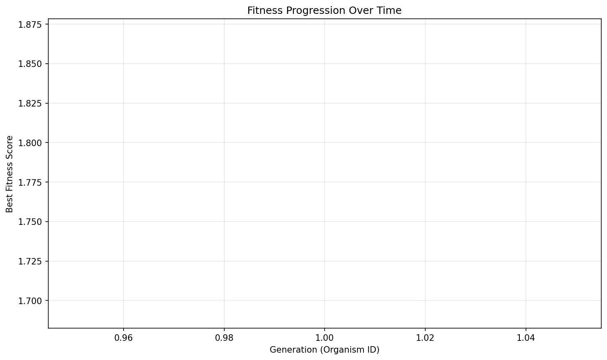

# Evolution Report

## Problem Information
- **Problem Name**: circle_packing
- **Timestamp**: 2025-06-20_16-07-41

## Hyperparameters
- **Exploration Rate**: 0.15
- **Elitism Rate**: 0.15
- **Max Steps**: 5
- **Target Fitness**: 2.5
- **Reason**: True
- **Max Concurrent**: 2

## Population Statistics
- **Number of Organisms**: 1
- **Best Fitness Score**: 1.780464893137411
- **Average Fitness Score**: 1.7805

## Fitness Progression


## Population Visualization


## Best Solution
```
import numpy as np

def run_packing():
    """
    Construct arrangement of 26 circles in unit square to maximize sum of radii.
    """
    n = 26
    centers = np.zeros((n, 2))
    
    # Central circle
    centers[0] = [0.5, 0.5]
    
    # Ring of 8 circles
    for i in range(8):
        angle = 2 * np.pi * i / 8
        centers[i + 1] = [0.5 + 0.25 * np.cos(angle), 0.5 + 0.25 * np.sin(angle)]
    
    # Ring of 16 circles
    for i in range(16):
        angle = 2 * np.pi * i / 16
        centers[i + 9] = [0.5 + 0.4 * np.cos(angle), 0.5 + 0.4 * np.sin(angle)]
    
    # One additional circle
    centers[25] = [0.5, 0.85]
    
    # Ensure all circles are well within the unit square
    centers = np.clip(centers, 0.1, 0.9)
    
    # Calculate radii
    n = centers.shape[0]
    radii = np.ones(n) * 0.05  # Start with small radii
    
    # Limit by distance to square borders
    for i in range(n):
        x, y = centers[i]
        radii[i] = min(x, y, 1 - x, 1 - y, 0.08)
    
    # Limit by distance to other circles
    for i in range(n):
        for j in range(i + 1, n):
            dist = np.sqrt(np.sum((centers[i] - centers[j]) ** 2))
            if radii[i] + radii[j] > dist * 0.95:  # Leave small gap
                scale = (dist * 0.95) / (radii[i] + radii[j])
                radii[i] *= scale
                radii[j] *= scale
    
    sum_radii = np.sum(radii)
    return centers, radii, sum_radii

```

## Additional Data from Best Solution
```json
{
  "sum_radii": "1.780465",
  "target_ratio": "0.675698",
  "validity": "valid",
  "target_value": "2.635"
}
```

## Files in this Report
- `population_visualization.gv` / `population_visualization.gv.png` - Visual representation of the population
- `fitness_progression.png` - Plot showing fitness improvement over generations
- `population.json` or `population.pkl` - Serialized population data
- `report.md` - This report file
