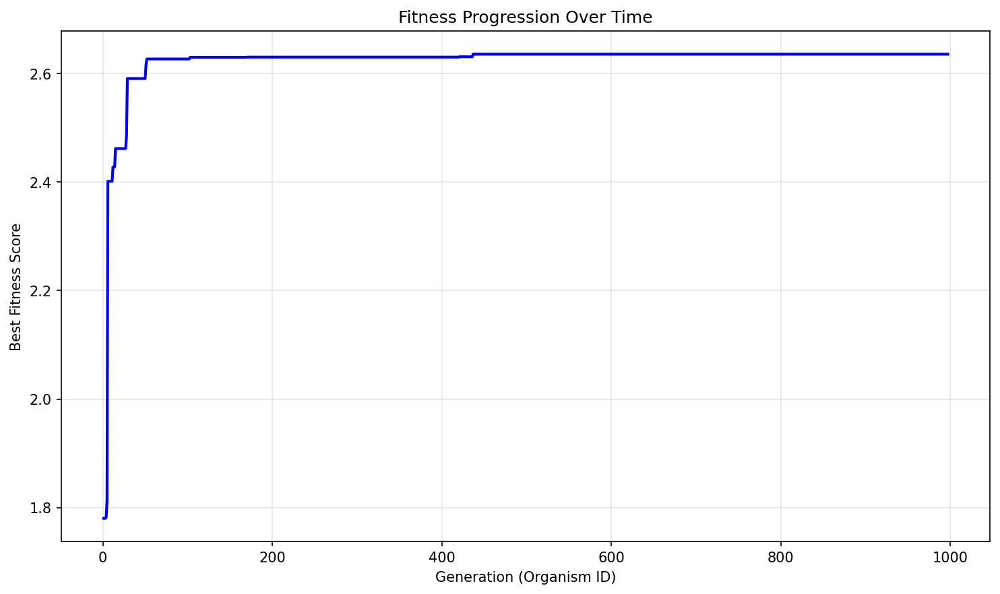

# Evolution Report (Evolver2 - Stochastic)

## Problem Information
- **Problem Name**: circle_packing
- **Timestamp**: 2025-06-21_13-22-31
- **Evolver**: Evolver2 (with stochastic behaviors)

## Hyperparameters
- **Exploration Rate**: 0.15
- **Elitism Rate**: 0.15
- **Max Steps**: 1000
- **Target Fitness**: 2.636
- **Reason**: True

## Stochastic Behaviors
- **1/100 iterations**: Large change to best solution using openai:o4-mini-2025-04-16
- **1/100 iterations**: Small iterative changes to best solution using openai:o4-mini-2025-04-16 (until no improvement)
- **Rest**: Normal evolution with model selection (openai:o4-mini-2025-04-16: 1/100, openai:gpt-4.1: ~14%, openai:gpt-4.1-mini: rest)
- **Big changes parameter**: 0.6 for below-average fitness, 0.2 for above-average fitness

## Population Statistics
- **Number of Organisms**: 997
- **Best Fitness Score**: 2.6354237071865314
- **Average Fitness Score**: 1.7225

## Fitness Progression


## Population Visualization


## Best Solution
```

import numpy as np
from scipy.optimize import minimize, NonlinearConstraint

def run_packing():
    n = 26
    centers = np.zeros((n, 2))
    radii = np.zeros(n)
    
    # Place 4 corner circles with slightly smaller radius
    r_corner = 0.12
    centers[0] = [r_corner, r_corner]
    centers[1] = [r_corner, 1-r_corner]
    centers[2] = [1-r_corner, r_corner]
    centers[3] = [1-r_corner, 1-r_corner]
    radii[:4] = r_corner
    
    # Place central circle with adjusted radius
    r_center = 0.15
    centers[4] = [0.5, 0.5]
    radii[4] = r_center
    
    # First hexagonal ring (6 circles)
    hex_radius1 = 0.08
    angles1 = np.linspace(0, 2*np.pi, 7)[:-1]
    for i in range(6):
        centers[5+i] = [0.5 + (r_center+hex_radius1)*np.cos(angles1[i]), 
                        0.5 + (r_center+hex_radius1)*np.sin(angles1[i])]
    radii[5:11] = hex_radius1
    
    # Second hexagonal ring (6 circles)
    hex_radius2 = 0.055
    angles2 = np.linspace(np.pi/6, 2*np.pi+np.pi/6, 7)[:-1]
    for i in range(6):
        centers[11+i] = [0.5 + (r_center+hex_radius1*2+hex_radius2)*np.cos(angles2[i]), 
                         0.5 + (r_center+hex_radius1*2+hex_radius2)*np.sin(angles2[i])]
    radii[11:17] = hex_radius2
    
    # Edge fillers (9 circles) - better initial positions
    edge_r = 0.045
    centers[17] = [0.25, 1-edge_r]
    centers[18] = [0.75, 1-edge_r]
    centers[19] = [0.25, edge_r]
    centers[20] = [0.75, edge_r]
    centers[21] = [edge_r, 0.25]
    centers[22] = [edge_r, 0.75]
    centers[23] = [1-edge_r, 0.25]
    centers[24] = [1-edge_r, 0.75]
    centers[25] = [0.5, 0.15]
    radii[17:26] = edge_r
    
    # Optimization setup
    x0 = np.zeros(78)
    x0[0:26] = centers[:, 0]
    x0[26:52] = centers[:, 1]
    x0[52:78] = radii
    
    bounds = [(0.0, 1.0)] * 52 + [(0.0, 0.5)] * 26
    
    # Boundary constraints
    def boundary_constraint(x):
        constraints = []
        for i in range(n):
            constraints.append(x[i] - x[52+i])       # x >= r
            constraints.append(1 - x[i] - x[52+i])   # x <= 1-r
            constraints.append(x[26+i] - x[52+i])    # y >= r
            constraints.append(1 - x[26+i] - x[52+i]) # y <= 1-r
        return np.array(constraints)
    
    # Non-overlap constraints
    def non_overlap_constraint(x):
        constraints = []
        for i in range(n):
            for j in range(i+1, n):
                dx = x[i] - x[j]
                dy = x[26+i] - x[26+j]
                r_sum = x[52+i] + x[52+j]
                constraints.append(dx**2 + dy**2 - r_sum**2)
        return np.array(constraints)
    
    boundary_con = NonlinearConstraint(boundary_constraint, 0, np.inf)
    overlap_con = NonlinearConstraint(non_overlap_constraint, 0, np.inf)
    
    def objective(x):
        return -np.sum(x[52:78])
    
    res = minimize(objective, x0, method='trust-constr', bounds=bounds,
                  constraints=[boundary_con, overlap_con],
                  options={'maxiter': 1000, 'verbose': 0})
    
    centers_opt = np.zeros((26, 2))
    centers_opt[:, 0] = res.x[0:26]
    centers_opt[:, 1] = res.x[26:52]
    radii_opt = res.x[52:78]
    sum_radii_opt = np.sum(radii_opt)
    
    return centers_opt, radii_opt, sum_radii_opt

```

## Additional Data from Best Solution
```json
{
  "sum_radii": "2.635424",
  "target_ratio": "1.000161",
  "validity": "valid",
  "target_value": "2.635"
}
```

## Files in this Report
- `population_visualization.gv` / `population_visualization.gv.png` - Visual representation of the population
- `fitness_progression.png` - Plot showing fitness improvement over generations
- `population.json` or `population.pkl` - Serialized population data
- `report.md` - This report file
