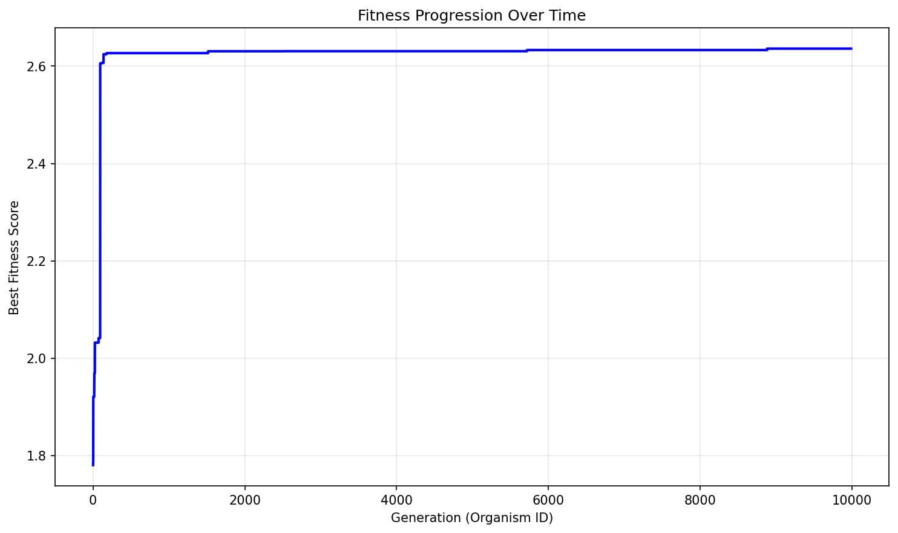

# Evolution Report

## Problem Information
- **Problem Name**: circle_packing
- **Timestamp**: 2025-06-22_00-13-25

## Hyperparameters
- **Exploration Rate**: 0.15
- **Elitism Rate**: 0.15
- **Max Steps**: 10000
- **Target Fitness**: 2.636
- **Reason**: True
- **Max Concurrent**: 40

## Population Statistics
- **Number of Organisms**: 9987
- **Best Fitness Score**: 2.6359830853311843
- **Average Fitness Score**: -661.3533

## Fitness Progression


## Population Visualization


## Best Solution
```

import numpy as np
from scipy.optimize import minimize

def run_packing():
    n = 26
    centers = np.zeros((n, 2))
    radii = np.zeros(n)
    
    # Place 4 larger corner circles with slightly increased radius
    corners = [(0,0), (0,1), (1,0), (1,1)]
    for i in range(4):
        centers[i] = corners[i]
        radii[i] = 0.233  # Slightly increased
    
    # Place 12 edge circles with optimized positions and radii
    edge_positions = [0.29, 0.455, 0.71]  # Adjusted spacing
    edge_radii = [0.143, 0.129, 0.123]  # More optimized variation
    for i in range(3):
        centers[4+i] = [edge_positions[i], 0]
        centers[7+i] = [edge_positions[i], 1]
        centers[10+i] = [0, edge_positions[i]]
        centers[13+i] = [1, edge_positions[i]]
        radii[4+i] = edge_radii[i]
        radii[7+i] = edge_radii[i]
        radii[10+i] = edge_radii[i]
        radii[13+i] = edge_radii[i]
    
    # Place remaining 10 circles in a more optimized pattern
    inner_positions = [
        (0.24, 0.24), (0.455, 0.24), (0.665, 0.24), (0.865, 0.24),
        (0.345, 0.415), (0.555, 0.415), (0.765, 0.415),
        (0.24, 0.565), (0.455, 0.565), (0.665, 0.565)
    ]
    inner_radii = [0.113, 0.109, 0.106, 0.102,
                  0.108, 0.106, 0.103,
                  0.107, 0.105, 0.102]
    for idx in range(16, 26):
        centers[idx] = inner_positions[idx-16]
        radii[idx] = inner_radii[idx-16]
    
    # Optimization with constraints
    def constraint_boundary(x):
        centers = x[:52].reshape(26, 2)
        radii = x[52:]
        return np.concatenate([centers[:,0] - radii, 
                             centers[:,1] - radii,
                             1 - centers[:,0] - radii,
                             1 - centers[:,1] - radii])
    
    def constraint_overlap(x):
        centers = x[:52].reshape(26, 2)
        radii = x[52:]
        constraints = []
        for i in range(26):
            for j in range(i+1, 26):
                dist = np.linalg.norm(centers[i] - centers[j])
                constraints.append(dist - radii[i] - radii[j])
        return np.array(constraints)
    
    def objective(x):
        return -np.sum(x[52:])
    
    x0 = np.concatenate([centers.flatten(), radii])
    bounds = [(0,1)]*52 + [(0, 0.25)]*26
    
    constraints = [
        {'type': 'ineq', 'fun': constraint_boundary},
        {'type': 'ineq', 'fun': constraint_overlap}
    ]
    
    # Fine-tuned optimization parameters for better convergence
    res = minimize(objective, x0, bounds=bounds, constraints=constraints,
                  method='SLSQP', options={'maxiter': 150000, 'ftol': 1e-13, 'eps': 1e-11})
    
    optimized = res.x
    centers = optimized[:52].reshape(26, 2)
    radii = optimized[52:]
    sum_radii = np.sum(radii)
    
    return centers, radii, sum_radii

```

## Additional Data from Best Solution
```json
{
  "sum_radii": "2.635983",
  "target_ratio": "0.999994",
  "validity": "valid",
  "target_value": "2.636"
}
```

## Files in this Report
- `population_visualization.gv` / `population_visualization.gv.png` - Visual representation of the population
- `fitness_progression.png` - Plot showing fitness improvement over generations
- `population.json` or `population.pkl` - Serialized population data
- `report.md` - This report file
