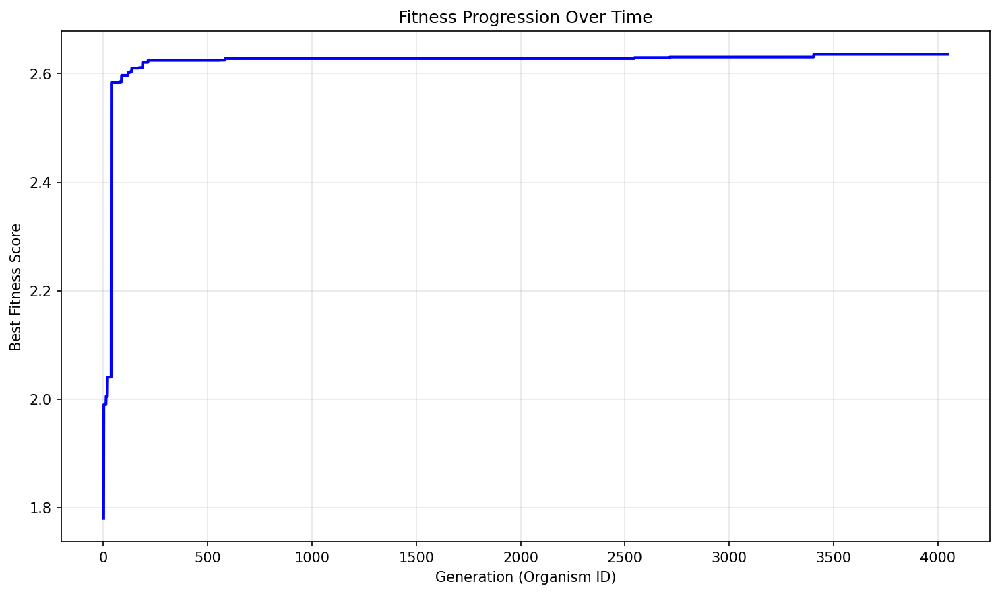

# Evolution Report

## Problem Information
- **Problem Name**: circle_packing
- **Timestamp**: 2025-06-25_02-18-38

## Hyperparameters
- **Exploration Rate**: 0.0
- **Elitism Rate**: 1.0
- **Max Steps**: 4000
- **Target Fitness**: 2.636
- **Reason**: True
- **Max Concurrent**: 40

## Population Statistics
- **Number of Organisms**: 4047
- **Best Fitness Score**: 2.635980044147077
- **Average Fitness Score**: 1.8944

## Fitness Progression


## Population Visualization


## Best Solution
```

import numpy as np
from scipy.optimize import minimize, NonlinearConstraint

def run_packing():
    n = 26
    
    # Hexagonal core (7 circles) - slightly tighter initial packing
    hex_radius = 0.118
    hex_centers = []
    hex_centers.append([0.5, 0.5])
    for i in range(6):
        angle = np.pi/3 * i
        hex_centers.append([0.5 + hex_radius*np.cos(angle), 0.5 + hex_radius*np.sin(angle)])
    
    # Outer ring (12 circles) - moved slightly outward
    ring_radius = 0.36
    ring_centers = []
    for i in range(12):
        angle = np.pi/6 * i
        ring_centers.append([0.5 + ring_radius*np.cos(angle), 0.5 + ring_radius*np.sin(angle)])
    
    # Edge circles (7 circles) - adjusted positions
    edge_centers = [
        [0.018, 0.018], [0.982, 0.018], [0.018, 0.982], [0.982, 0.982],
        [0.24, 0.008], [0.76, 0.008], [0.5, 0.992]
    ]
    
    centers = np.array(hex_centers + ring_centers[:12] + edge_centers[:7])
    
    # Initial radii - adjusted distribution with larger central circle
    x0 = np.zeros(3*n)
    x0[:n] = [0.212, 0.132, 0.132, 0.132, 0.132, 0.132, 0.132] + [0.106]*12 + [0.102]*7
    x0[n:2*n] = centers[:,0]
    x0[2*n:] = centers[:,1]
    
    def objective(x):
        return -np.sum(x[:n])
    
    def bounds_constraint(x):
        radii = x[:n]
        x_coords = x[n:2*n]
        y_coords = x[2*n:]
        return np.concatenate([
            x_coords - radii,
            y_coords - radii,
            1 - x_coords - radii,
            1 - y_coords - radii
        ])
    
    def non_overlap_constraint(x):
        radii = x[:n]
        centers = np.column_stack((x[n:2*n], x[2*n:]))
        constraints = []
        for i in range(n):
            for j in range(i+1, n):
                dx = centers[i,0] - centers[j,0]
                dy = centers[i,1] - centers[j,1]
                constraints.append(np.sqrt(dx*dx + dy*dy) - (radii[i] + radii[j]))
        return np.array(constraints)
    
    cons = [
        {'type': 'ineq', 'fun': bounds_constraint},
        NonlinearConstraint(non_overlap_constraint, 0, np.inf)
    ]
    
    # Adjusted bounds to allow slightly larger radii
    bounds = [(0.02, 0.29)]*7 + [(0.02, 0.19)]*12 + [(0.02, 0.26)]*7 + [(0,1)]*(2*n)
    
    # Enhanced optimization sequence with more iterations
    res1 = minimize(
        objective, x0, method='SLSQP',
        bounds=bounds, constraints=cons,
        options={'maxiter': 30000, 'ftol': 1e-16}
    )
    
    res2 = minimize(
        objective, res1.x, method='trust-constr',
        bounds=bounds, constraints=cons,
        options={'maxiter': 50000, 'xtol': 1e-18, 'gtol': 1e-18}
    )
    
    res3 = minimize(
        objective, res2.x, method='SLSQP',
        bounds=bounds, constraints=cons,
        options={'maxiter': 25000, 'ftol': 1e-19}
    )
    
    radii = res3.x[:n]
    centers = np.column_stack((res3.x[n:2*n], res3.x[2*n:]))
    sum_radii = np.sum(radii)
    
    return centers, radii, sum_radii

```

## Additional Data from Best Solution
```json
{
  "sum_radii": "2.635980",
  "target_ratio": "0.999992",
  "validity": "valid",
  "target_value": "2.636"
}
```

## Files in this Report
- `population_visualization.gv` / `population_visualization.gv.png` - Visual representation of the population
- `fitness_progression.png` - Plot showing fitness improvement over generations
- `population.json` or `population.pkl` - Serialized population data
- `report.md` - This report file
