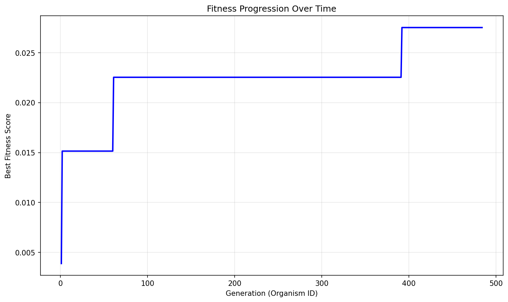
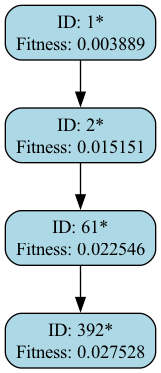

# Evolution Report

## Problem Information
- **Problem Name**: heilbronn_triangles
- **Timestamp**: 2025-07-11_21-06-43

## Hyperparameters
- **Exploration Rate**: 0.0
- **Elitism Rate**: 1.0
- **Max Steps**: 500
- **Target Fitness**: 0.037
- **Reason**: True

## Evolver Configuration
- **Max Concurrent**: 20
- **Model Mix**: {
  "deepseek:deepseek-reasoner": 0.01,
  "deepseek:deepseek-chat": 0.99
}
- **Big Changes Rate**: 0.2
- **Best Model**: deepseek:deepseek-reasoner
- **Max Children Per Organism**: 20
- **Checkpoint Dir**: checkpoints
- **Population Path**: None

## Population Statistics
- **Number of Organisms**: 484
- **Best Fitness Score**: 0.027528201832357695
- **Average Fitness Score**: 0.0010
- **Number of Best-So-Far Organisms**: 4

## Best-So-Far Organisms Summary
These organisms were the best fitness when they were created:

| ID | Fitness | Improvement |
|----|---------|-------------|
| 1 | 0.00388948 | +0.00388948 |
| 2 | 0.01515107 | +0.01126159 |
| 61 | 0.02254603 | +0.00739496 |
| 392 | 0.02752820 | +0.00498218 |

## Fitness Progression


## Population Visualization


## Ancestry Analysis


For detailed ancestry analysis of the best organism, see [best_ancestry.md](best_ancestry.md).

## Best Solution
```

from __future__ import annotations
import math
import random
import itertools
from typing import List, Tuple
import numpy as np

SQRT3 = math.sqrt(3.0)

def _area(p: np.ndarray, q: np.ndarray, r: np.ndarray) -> float:
    return abs(np.cross(q - p, r - p)) * 0.5

_A = np.array([0.0, 0.0])
_B = np.array([1.0, 0.0])
_C = np.array([0.5, SQRT3 / 2.0])

def _random_point() -> np.ndarray:
    while True:
        u, v = random.random(), random.random()
        if u + v <= 1.0:
            break
    return (1 - u - v) * _A + u * _B + v * _C

def _project_to_simplex(p: np.ndarray) -> np.ndarray:
    M = np.column_stack((_B - _A, _C - _A))
    uv = np.linalg.lstsq(M, p - _A, rcond=None)[0]
    u, v = uv
    w = 1.0 - u - v
    if u >= 0 and v >= 0 and w >= 0:
        return p
    u = max(0.0, min(1.0, u))
    v = max(0.0, min(1.0, v))
    if u + v > 1.0:
        s = u + v
        u /= s
        v /= s
    return (1 - u - v) * _A + u * _B + v * _C

def _initial_configuration(n_pts: int = 11) -> np.ndarray:
    pts = []
    pts.extend([_A, _B, _C])
    pts.append((_A + _B) / 2)
    pts.append((_A + _C) / 2)
    pts.append((_B + _C) / 2)
    pts.append((_A + _B + _C) / 3)
    while len(pts) < n_pts:
        pts.append(_random_point())
    return np.array(pts)

n_pts_fixed = 11
triplets = list(itertools.combinations(range(n_pts_fixed), 3))
point_to_triplets = [[] for _ in range(n_pts_fixed)]
for idx, (i, j, k) in enumerate(triplets):
    point_to_triplets[i].append(idx)
    point_to_triplets[j].append(idx)
    point_to_triplets[k].append(idx)

def _anneal(n_pts: int = 11,
            iters: int = 30000,
            start_temp: float = 0.2,
            end_temp: float = 1e-8,
            seed: int | None = 0) -> np.ndarray:
    rng = random.Random(seed)
    pts = _initial_configuration(n_pts)
    
    areas_arr = np.zeros(len(triplets))
    for idx, (i, j, k) in enumerate(triplets):
        areas_arr[idx] = _area(pts[i], pts[j], pts[k])
    current_val = np.min(areas_arr)
    
    best_pts = pts.copy()
    best_val = current_val

    for t in range(iters):
        T = start_temp * (end_temp / start_temp) ** (t / (iters - 1))
        step_size = 0.05 * (1 - (t/iters)**0.5) + 0.001
        
        idx = rng.randrange(n_pts)
        trial_pts = pts.copy()
        if rng.random() < 0.05:
            trial_pts[idx] = _random_point()
        else:
            delta_x = rng.uniform(-step_size, step_size)
            delta_y = rng.uniform(-step_size, step_size)
            trial_pts[idx] += np.array([delta_x, delta_y])
            trial_pts[idx] = _project_to_simplex(trial_pts[idx])

        trial_areas = areas_arr.copy()
        for triplet_idx in point_to_triplets[idx]:
            i, j, k = triplets[triplet_idx]
            trial_areas[triplet_idx] = _area(trial_pts[i], trial_pts[j], trial_pts[k])
        trial_val = np.min(trial_areas)
        
        delta = trial_val - current_val
        if delta > 0 or rng.random() < math.exp(delta / max(T, 1e-12)):
            pts = trial_pts
            areas_arr = trial_areas
            current_val = trial_val
            if trial_val > best_val:
                best_val = trial_val
                best_pts = trial_pts.copy()

    return best_pts

def find_points(seed: int | None = 0) -> List[Tuple[float, float]]:
    pts = _anneal(n_pts=11, iters=30000, seed=seed)
    return [(float(f"{x:.8f}"), float(f"{y:.8f}")) for x, y in pts]

```

## Additional Data from Best Solution
```json
{
  "num_points": "11",
  "min_area_normalized": "0.027528",
  "validity": "valid",
  "execution_time_seconds": "22.189",
  "timeout_occurred": "false",
  "points": "[[0.17491183, 0.30295617], [0.56915579, 0.6539094], [0.89078363, 0.12498403], [0.18202865, 0.11761305], [0.32191707, 0.3733213], [0.83082874, 0.0026321], [0.75777021, 0.4195543], [0.60822656, 0.29966811], [0.4332828, 0.0], [0.32985124, 0.56156977], [0.56420485, 0.0879055]]"
}
```

## Creation Information for Best Solution
```json
{
  "model": "deepseek:deepseek-reasoner",
  "change_type": "SMALL ITERATIVE IMPROVEMENT",
  "step": 306,
  "is_reasoning": true,
  "big_changes_rate": 0.2,
  "child_number": 313
}
```

## Files in this Report
- `population_visualization.gv` / `population_visualization.gv.png` - Visual representation of the population
- `fitness_progression.png` - Plot showing fitness improvement over generations  
- `ancestry_graph.png` - Visualization of best organisms' ancestry relationships
- `best_ancestry.md` - Detailed ancestry analysis of the fittest organism
- `population.json` / `population.pkl` - Serialized population data
- `report.md` - This comprehensive report file

## Configuration Reproducibility

To reproduce this evolution run exactly, use the following configuration:

### Problem Specification
```python
from src.specification import get_heilbronn_triangles_spec

spec = get_heilbronn_triangles_spec()
```

### Evolver Configuration  
```python
evolver_config = {
  "checkpoint_dir": "checkpoints",
  "max_concurrent": 20,
  "model_mix": {
    "deepseek:deepseek-reasoner": 0.01,
    "deepseek:deepseek-chat": 0.99
  },
  "big_changes_rate": 0.2,
  "best_model": "deepseek:deepseek-reasoner",
  "max_children_per_organism": 20,
  "population_path": null
}
```

### Full Reproduction Script
```python
from src.evolve import AsyncEvolver

# Get specification and config
spec = get_heilbronn_triangles_spec()
evolver_config = {
  "checkpoint_dir": "checkpoints",
  "max_concurrent": 20,
  "model_mix": {
    "deepseek:deepseek-reasoner": 0.01,
    "deepseek:deepseek-chat": 0.99
  },
  "big_changes_rate": 0.2,
  "best_model": "deepseek:deepseek-reasoner",
  "max_children_per_organism": 20,
  "population_path": null
}

# Create evolver
evolver = AsyncEvolver(
    specification=spec,
    **evolver_config
)

# Run evolution
population = await evolver.evolve()

# Generate report
from src.reporting import EvolutionReporter
reporter = EvolutionReporter(population, spec, evolver_config)
report_dir = reporter.generate_report()
```
