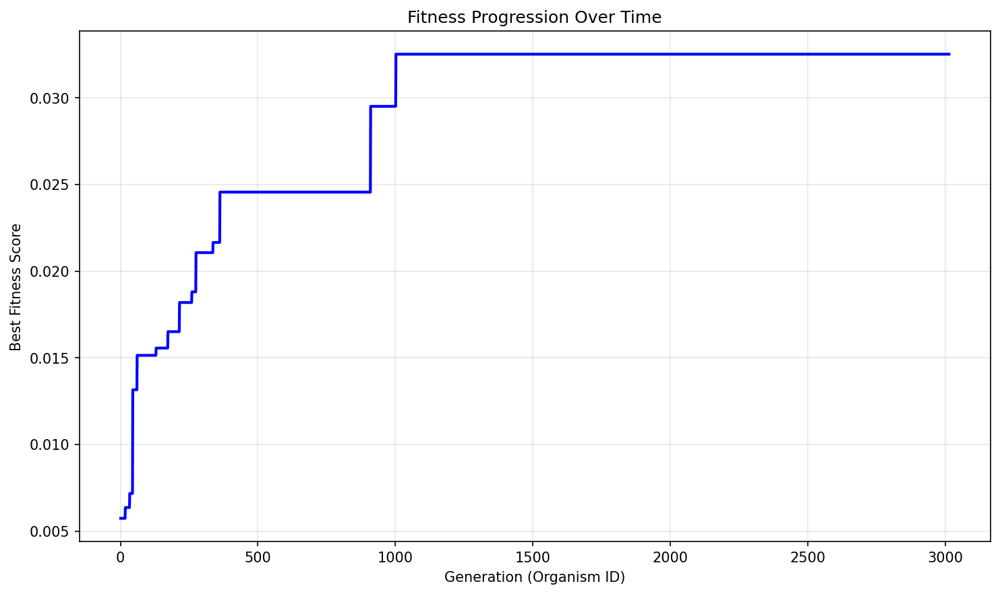
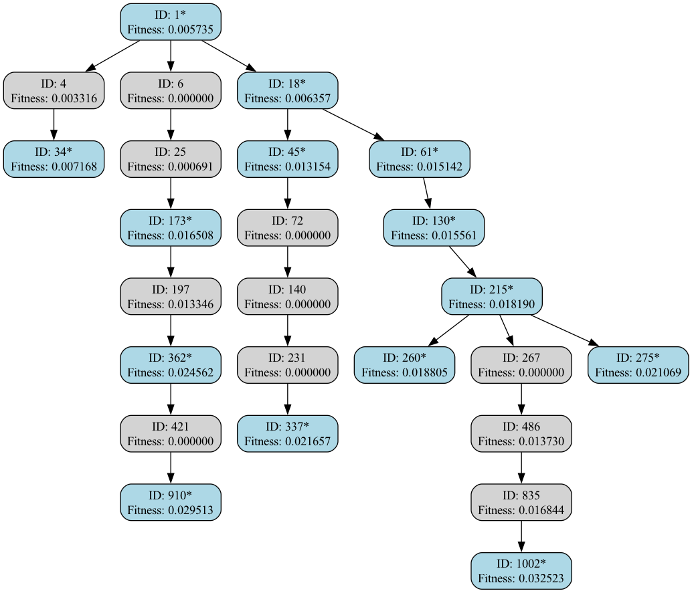

# Evolution Report

## Problem Information
- **Problem Name**: heilbronn_triangles
- **Timestamp**: 2025-07-12_00-28-00

## Hyperparameters
- **Exploration Rate**: 0.1
- **Elitism Rate**: 0.4
- **Max Steps**: 3000
- **Target Fitness**: 0.037
- **Reason**: True

## Evolver Configuration
- **Max Concurrent**: 20
- **Model Mix**: {
  "deepseek:deepseek-reasoner": 0.01,
  "deepseek:deepseek-chat": 0.99
}
- **Big Changes Rate**: 0.2
- **Best Model**: deepseek:deepseek-reasoner
- **Max Children Per Organism**: 20
- **Checkpoint Dir**: checkpoints
- **Population Path**: None

## Population Statistics
- **Number of Organisms**: 3013
- **Best Fitness Score**: 0.03252311844636642
- **Average Fitness Score**: 0.0040
- **Number of Best-So-Far Organisms**: 14

## Best-So-Far Organisms Summary
These organisms were the best fitness when they were created:

| ID | Fitness | Improvement |
|----|---------|-------------|
| 1 | 0.00573459 | +0.00573459 |
| 18 | 0.00635695 | +0.00062236 |
| 34 | 0.00716795 | +0.00081101 |
| 45 | 0.01315374 | +0.00598578 |
| 61 | 0.01514223 | +0.00198850 |
| 130 | 0.01556142 | +0.00041919 |
| 173 | 0.01650788 | +0.00094646 |
| 215 | 0.01819040 | +0.00168253 |
| 260 | 0.01880514 | +0.00061474 |
| 275 | 0.02106893 | +0.00226379 |
| 337 | 0.02165738 | +0.00058845 |
| 362 | 0.02456154 | +0.00290416 |
| 910 | 0.02951318 | +0.00495164 |
| 1002 | 0.03252312 | +0.00300994 |

## Fitness Progression


## Population Visualization


## Ancestry Analysis


For detailed ancestry analysis of the best organism, see [best_ancestry.md](best_ancestry.md).

## Best Solution
```

from __future__ import annotations

import math
import random
import itertools
from typing import List, Tuple
import numpy as np

SQRT3 = math.sqrt(3.0)

def _area(p, q, r) -> float:
    return abs((q[0]-p[0])*(r[1]-p[1]) - (q[1]-p[1])*(r[0]-p[0])) * 0.5

comb = list(itertools.combinations(range(11), 3))

def _min_triangle_area(pts: np.ndarray) -> float:
    best = float("inf")
    for tri in comb:
        i, j, k = tri
        a = _area(pts[i], pts[j], pts[k])
        if a < best:
            best = a
    return best

_A = np.array([0.0, 0.0])
_B = np.array([1.0, 0.0])
_C = np.array([0.5, SQRT3 / 2.0])

def _random_point() -> np.ndarray:
    while True:
        u, v = random.random(), random.random()
        if u + v <= 1.0:
            break
    return (1 - u - v) * _A + u * _B + v * _C

def _project_to_simplex(p: np.ndarray) -> np.ndarray:
    M = np.column_stack((_B - _A, _C - _A))
    uv = np.linalg.lstsq(M, p - _A, rcond=None)[0]
    u, v = uv
    w = 1.0 - u - v
    
    eps = 1e-8
    u = max(eps, min(1.0-eps, u))
    v = max(eps, min(1.0-eps, v))
    if u + v > 1.0 - eps:
        s = u + v
        u = (1.0 - eps) * u / s
        v = (1.0 - eps) * v / s
    
    return (1 - u - v) * _A + u * _B + v * _C

def _initial_configuration(n_pts: int = 11) -> np.ndarray:
    pts = []
    pts.append(_A.copy())
    pts.append(_B.copy())
    pts.append(_C.copy())
    
    golden_angle = math.pi * (3 - math.sqrt(5))
    for i in range(1, n_pts - 2):
        theta = golden_angle * i
        r = math.sqrt(i / (n_pts - 3))
        u = 0.5 + r * math.cos(theta) * 0.5
        v = 0.5 + r * math.sin(theta) * 0.5
        if u > 0 and v > 0 and u + v < 1:
            pts.append((1 - u - v) * _A + u * _B + v * _C)
    
    while len(pts) < n_pts:
        u = random.uniform(0.1, 0.9)
        v = random.uniform(0.1, 0.9)
        if u + v < 0.95:
            pt = (1 - u - v) * _A + u * _B + v * _C
            if not any(np.allclose(pt, x, atol=1e-6) for x in pts):
                pts.append(pt)
    return np.array(pts[:n_pts])

def _anneal(n_pts: int = 11,
            iters: int = 40000,
            start_temp: float = 0.2,
            end_temp: float = 1e-10,
            seed: int | None = 0) -> np.ndarray:
    rng = random.Random(seed)
    pts = _initial_configuration(n_pts)
    best_pts = pts.copy()
    best_val = _min_triangle_area(best_pts)

    for t in range(iters):
        T = start_temp * (end_temp / start_temp) ** (t / iters)
        step_size = 0.15 * (1 - t/iters) + 0.001
        idx = rng.randrange(n_pts)
        trial = pts.copy()
        trial[idx] += rng.gauss(0, step_size), rng.gauss(0, step_size)
        trial[idx] = _project_to_simplex(trial[idx])

        trial_val = _min_triangle_area(trial)
        delta = trial_val - best_val

        if delta > 0 or rng.random() < math.exp(delta / max(T, 1e-12)):
            pts = trial
            if trial_val > best_val:
                best_val = trial_val
                best_pts = trial.copy()

    return best_pts

def _local_perturb(pts: np.ndarray, steps: int = 3000) -> np.ndarray:
    best_pts = pts.copy()
    best_val = _min_triangle_area(best_pts)
    n_pts = len(pts)
    
    for step_idx in range(steps):
        trial = best_pts.copy()
        idx = random.randrange(n_pts)
        step = 0.06 * (1 - step_idx/steps)
        trial[idx] += random.gauss(0, step), random.gauss(0, step)
        trial[idx] = _project_to_simplex(trial[idx])
        trial_val = _min_triangle_area(trial)
        if trial_val > best_val:
            best_val = trial_val
            best_pts = trial.copy()
    
    return best_pts

def find_points(seed: int | None = 0) -> List[Tuple[float, float]]:
    pts = _anneal(n_pts=11, iters=40000, seed=seed)
    pts = _local_perturb(pts, steps=3000)
    return [(float(f"{x:.8f}"), float(f"{y:.8f}")) for x, y in pts]

```

## Additional Data from Best Solution
```json
{
  "num_points": "11",
  "min_area_normalized": "0.032523",
  "validity": "valid",
  "execution_time_seconds": "12.860",
  "timeout_occurred": "false",
  "points": "[[0.95684043, 0.01592212], [0.74261963, 0.44579586], [0.25091112, 0.20456143], [0.7489701, 0.20849329], [0.08487134, 0.04401777], [0.63224382, 0.05905938], [0.56201469, 0.67624976], [0.43242899, 0.68386457], [0.27306066, 0.47280394], [0.38927298, 1e-08], [0.52032572, 0.26639469]]"
}
```

## Creation Information for Best Solution
```json
{
  "model": "deepseek:deepseek-chat",
  "change_type": "SMALL ITERATIVE IMPROVEMENT",
  "step": 989,
  "is_reasoning": true,
  "big_changes_rate": 0.2,
  "child_number": 1
}
```

## Files in this Report
- `population_visualization.gv` / `population_visualization.gv.png` - Visual representation of the population
- `fitness_progression.png` - Plot showing fitness improvement over generations  
- `ancestry_graph.png` - Visualization of best organisms' ancestry relationships
- `best_ancestry.md` - Detailed ancestry analysis of the fittest organism
- `population.json` / `population.pkl` - Serialized population data
- `report.md` - This comprehensive report file

## Configuration Reproducibility

To reproduce this evolution run exactly, use the following configuration:

### Problem Specification
```python
from src.specification import get_heilbronn_triangles_spec

spec = get_heilbronn_triangles_spec()
```

### Evolver Configuration  
```python
evolver_config = {
  "checkpoint_dir": "checkpoints",
  "max_concurrent": 20,
  "model_mix": {
    "deepseek:deepseek-reasoner": 0.01,
    "deepseek:deepseek-chat": 0.99
  },
  "big_changes_rate": 0.2,
  "best_model": "deepseek:deepseek-reasoner",
  "max_children_per_organism": 20,
  "population_path": null
}
```

### Full Reproduction Script
```python
from src.evolve import AsyncEvolver

# Get specification and config
spec = get_heilbronn_triangles_spec()
evolver_config = {
  "checkpoint_dir": "checkpoints",
  "max_concurrent": 20,
  "model_mix": {
    "deepseek:deepseek-reasoner": 0.01,
    "deepseek:deepseek-chat": 0.99
  },
  "big_changes_rate": 0.2,
  "best_model": "deepseek:deepseek-reasoner",
  "max_children_per_organism": 20,
  "population_path": null
}

# Create evolver
evolver = AsyncEvolver(
    specification=spec,
    **evolver_config
)

# Run evolution
population = await evolver.evolve()

# Generate report
from src.reporting import EvolutionReporter
reporter = EvolutionReporter(population, spec, evolver_config)
report_dir = reporter.generate_report()
```
